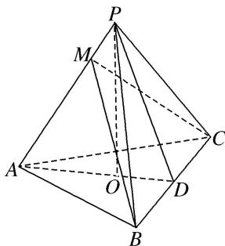
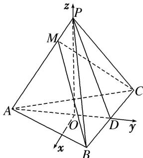

<!-- question-source:start -->
7. 如图，在三棱锥 $P - ABC$ 中， $AB = AC$ ， $D$ 为 $BC$ 的中点， $PO \perp$ 平面 $ABC$ ，垂足 $O$ 落在线段 $AD$ 上．已知 $BC = 8$ ， $PO = 4$ ， $AO = 3$ ， $OD = 2$ ．点 $M$ 是线段 $AP$ 上一点，且 $AM = 3$ ，试建立适当的空间直角坐标系并确定各点坐标.

## 7. 解析 本题属垂面模型1-3建系类型

如图所示，以 O 为坐标原点，以射线 OP 为 z 轴的正半轴建立空间直角坐标系 O-xyz.

则 $O(0, 0, 0)$ ， $A(0, -3, 0)$ ， $D(0, -2, 0)$ ， $B(4, 2, 0)$ ， $C(-4, 2, 0)$ ， $P(0, 0, 4)$ ， $M(0, -\frac{9}{5}, \frac{12}{5})$ .
<!-- question-source:end -->
