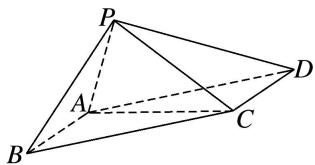

<!-- question-source:start -->
8. 如图，在四棱锥 P-ABCD 中，底面 ABCD 是平行四边形， $AB = AC = 2$ ， $AD = 2\sqrt{2}$ ， $PB = \sqrt{2}$ ， $PB \perp AC$ 。且 $\angle PBA = 45^{\circ}$ ，试建立适当的空间直角坐标系并确定各点坐标。

<!-- question-source:end -->

![[高中/总复习/专题/立体几何/专题08 立体几何中的建系求(设)点问题-立体几何（理科）/专题08_立体几何中的建系求_设_点问题/对点训练/answers/Q00039686A1.md]]
