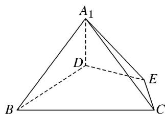

<!-- question-source:start -->
5. 等边 $\triangle ABC$ 的边长为 3，点 $D, E$ 分别是 $AB, AC$ 上的点，且满足 $\frac{AD}{DB} = \frac{CE}{EA} = \frac{1}{2}$ (如图①)，将 $\triangle ADE$ 沿 $DE$ 折起到 $\triangle A_{1}DE$ 的位置，使二面角 $A_{1} - DE - B$ 成直二面角，连接 $A_{1}B, A_{1}C$ (如图②). 试建立适当的空间直角坐标系并确定各点坐标.

  
图①

  
图②
<!-- question-source:end -->

![[高中/总复习/专题/立体几何/专题08 立体几何中的建系求(设)点问题-立体几何（理科）/专题08_立体几何中的建系求_设_点问题/对点训练/answers/Q00043602A1.md]]
