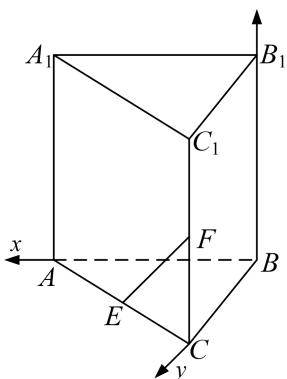

> [!faq]- 《专题08 立体几何中的建系求(设)点问题-立体几何（理科）》例题解析
>
> > [!success]- **【答案】** 详见解析
>
> > [!note]- **【分析】**
> > 本题未单列分析。
>
> > [!note]- **【解析】**
> > $$
> > \therefore C F = 1, B F = \sqrt {5}, \because B F \perp A _ {1} B _ {1}, A _ {1} B _ {1} / / A B, \therefore B F \perp A B,
> > $$
> > $\therefore AF = \sqrt{AB^2 + BF^2} = \sqrt{2^2 + (\sqrt{5})^2} = 3, AC = \sqrt{AF^2 - CF^2} = \sqrt{3^2 - 1^2} = 2\sqrt{2}, \therefore AB^2 + BC^2 = AC^2$ ，即 $BA \perp BC$ . 故以 $B$ 为原点， $BA, BC, BB_1$ 所在直线分别为 $x, y, z$ 轴建立如图所示的空间直角坐标系，
> > 
> > 则 $B(0, 0, 0)$ ， $A(2, 0, 0)$ ， $C(0, 2, 0)$ ， $E(1, 1, 0)$ ， $F(0, 2, 1)$ ，
