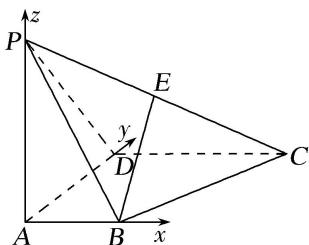

> [!faq]- 《专题08 立体几何中的建系求(设)点问题-立体几何（理科）》例题解析
>
> > [!success]- **【答案】** 详见解析
>
> > [!note]- **【分析】**
> > 本题未单列分析。
>
> > [!note]- **【解析】**
> > 解析 本题属墙角模型建系类型
> > 
> > 依题意，以点 A 为原点建立空间直角坐标系(如图)，可得 $A(0, 0, 0)$ ， $B(1, 0, 0)$ ， $D(0, 2, 0)$ ， $P(0, 0, 2)$ ， $C(2, 2, 0)$ ，由 E 为棱 PC 的中点，得 $E(1, 1, 1)$ .
