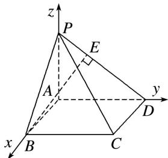

> [!faq]- 《专题08 立体几何中的建系求(设)点问题-立体几何（理科）》例题解析
>
> > [!success]- **【答案】** 详见解析
>
> > [!note]- **【分析】**
> > 本题未单列分析。
>
> > [!note]- **【解析】**
> > 解析 本题属墙角模型建系类型
> > ∵PA⊥平面ABCD，∴∠PDA即为PD与平面ABCD所成的角，
> > $$
> > \therefore \angle P D A = 4 5 ^ {\circ}, \therefore P A = A D = 4, A B = 2.
> > $$
> > 以 A 为原点，AB，AD，AP 所在直线分别为 x 轴，y 轴，z 轴建立空间直角坐标系，如图所示.
> > 
> > $\therefore A(0, 0, 0), B(2, 0, 0), D(0, 4, 0), P(0, 0, 4),$
> > 设 $E(x, y, z)$ ， $\because \overrightarrow{DP} = (0, -4, 4)$ ， $\overrightarrow{DE} = \lambda \overrightarrow{DP}$ ，且 $BE \perp DP$
> > ∴ 点 $E(0, 4-4\lambda, 4\lambda)$ ， $\overrightarrow{BE}=(-2, 4-4\lambda, 4\lambda)$ .
> > $\because BE\perp DP,\quad\therefore\overrightarrow{BE}\cdot\overrightarrow{DP}=-4(4-4\lambda)+4\times4\lambda=0,$ 解得 $\lambda=\frac{1}{2}.$ $\therefore$ 点 $E(0,2,2),$
