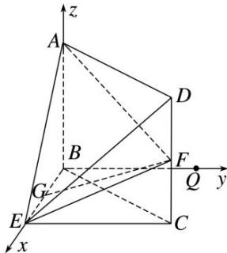

> [!faq]- 《专题08 立体几何中的建系求(设)点问题-立体几何（理科）》例题解析
>
> > [!success]- **【答案】** 详见解析
>
> > [!note]- **【解析】**
> > 解析 本题属垂面模型1-1建系类型
> >
> > 如图，在平面 BEC 内，过 B 点作 $BQ \parallel EC$ 。因为 $BE \perp CE$ ，所以 $BQ \perp BE$ 。
> >
> > 
> >
> > 又因为 $AB \perp$ 平面 $BEC$ ，所以 $AB \perp BE$ ， $AB \perp BQ$ .
> >
> > 以 $B$ 为原点，分别以 $BE$ ， $BQ$ ， $BA$ 所在直线为 $x$ 轴， $y$ 轴， $z$ 轴，建立空间直角坐标系 $Bxyz$ ，
> >
> > 则 $B(0, 0, 0)$ ， $E(2, 0, 0)$ ， $A(0, 0, 2)$ ， $G(1, 0, 0)$ ， $C(2, 2, 0)$ ， $D(2, 2, 2)$ ， $F(2, 2, 1)$ .
