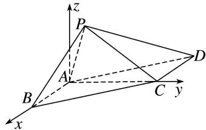
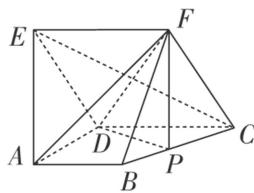
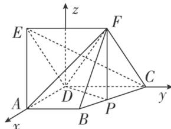

> [!faq]- 《专题08 立体几何中的建系求(设)点问题-立体几何（理科）》例题解析
>
> > [!success]- **【答案】** 详见解析
>
> > [!note]- **【分析】**
> > 本题未单列分析。
>
> > [!note]- **【解析】**
> > 解析 本题属垂面模型2-1建系类型
> > 因为四边形 ABCD 是平行四边形， $AD=2\sqrt{2}$ ，所以 $BC=AD=2\sqrt{2}$ ，
> > 又 AB=AC=2，所以 $AB^{2}+AC^{2}=BC^{2}$ ，所以 $AC\perp AB$ ，
> > 又 $PB \perp AC$ ， $AB \cap PB = B$ ，AB， $PB \subset$ 平面 PAB，所以 $AC \perp$ 平面 PAB.
> > 分别以 AB, AC 所在直线为 x 轴, y 轴, 平面 PAB 内过点 A 且与直线 AB 垂直的直线为 z 轴, 建立空间直角坐标系 Axyz,
> > 
> > 则 $A(0, 0, 0)$ ， $B(2, 0, 0)$ ， $C(0, 2, 0)$ ， $D(-2, 2, 0)$ ，由 $\angle PBA = 45^{\circ}$ ， $PB = \sqrt{2}$ ，可得 $P(1, 0, 1)$ ，如图，在五面体 ABCDEF 中，底面 ABCD 是直角梯形， $AB \parallel CD$ ， $AD \perp CD$ ，侧面 CDEF 是菱形， $\angle DCF = 60^{\circ}$ ， $CD = 2AD = 2AB = 2$ ， $AE = \sqrt{5}AD$ ，试建立适当的空间直角坐标系并确定各点坐标.
> > 
> > 9. 解析 本题属垂面模型3-1建系类型
> > $$
> > \because C D = 2 A D = 2 A B = 2, \quad A E = \sqrt {5} A D, \quad \therefore C D = 2, \quad A D = 1, \quad A B = 1, \quad A E = \sqrt {5}.
> > $$
> > $$
> > \therefore A E ^ {2} = A D ^ {2} + D E ^ {2}, \quad \therefore A D \perp D E. \quad \because A D \perp C D, \quad C D \cap D E = D, \quad \therefore A D \perp \text {平面} C D E F,
> > $$
> > 以 D 为坐标原点，DA，DC 所在直线分别为 x 轴、y 轴，建立如图所示的空间直角坐标系 Dxyz，
> > 
> > 由题设可得 $D(0, 0, 0)$ ， $A(1, 0, 0)$ ， $C(0, 2, 0)$ ， $B(1, 1, 0)$ ， $E(0, -1, \sqrt{3})$ ， $F(0, 1, \sqrt{3})$ ，
