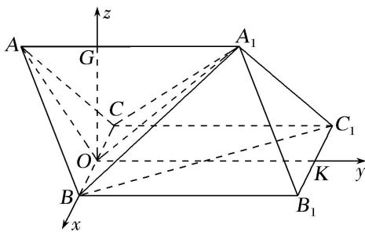

> [!faq]- 《专题08 立体几何中的建系求(设)点问题-立体几何（理科）》例题解析
>
> > [!success]- **【答案】** 详见解析
>
> > [!note]- **【解析】**
> > 解析 本题属垂面模型 3-1 建系类型
> >
> > ∵ AB=2， $A_{1}B=\sqrt{7}$ ， $\angle A_{1}AB=60^{\circ}$ ，∴由余弦定理得 $A_{1}B^{2}=AA_{1}^{2}+AB^{2}-2AA_{1}\cdot AB\cos\angle A_{1}AB$ ，
> >
> > 即 $AA_{1}^{2}-2AA_{1}-3=0\Rightarrow AA_{1}=3$ 或 $AA_{1}=-1$ (舍)，故 $AA_{1}=3$ .
> >
> > 取 BC 的中点 O，连接 OA， $OA_{1}$ ，∵ $\triangle ABC$ 是边长为 2 的正三角形，∴ $AO \perp BC$ ，且 $AO = \sqrt{3}$ ，BO = 1。由 AB = AC， $\angle A_{1}AB = \angle A_{1}AC$ ， $AA_{1} = AA_{1}$ 得 $\triangle A_{1}AB \cong \triangle A_{1}AC$ ，得 $A_{1}B = A_{1}C = \sqrt{7}$ ，
> >
> > $$
> > A _ {1} O \perp B C, \text {且} A _ {1} O = \sqrt {6}. \because A O ^ {2} + A _ {1} O ^ {2} = 3 + 6 = 9 = A A _ {1} ^ {2}, \therefore A O \perp A _ {1} O.
> > $$
> >
> > 
> >
> > 以 O 为原点，OB 所在的直线为 x 轴，取 $B_{1}C_{1}$ 的中点 K，连接 OK，以 OK 所在的直线为 y 轴，过 O 作 $OG \perp AA_{1}$ ，以 OG 所在的直线为 z 轴建立空间直角坐标系，
> >
> > 则 $B(1, 0, 0)$ ， $B_{1}(1, 3, 0)$ ， $C(-1, 0, 0)$ ， $C_{1}(-1, 3, 0)$ ，
> >
> > 在 Rt△ABC 中，∵ $AO=\sqrt{3}$ ， $A_{1}O=\sqrt{6}$ ， $AA_{1}=3$ 。∴ $OG=\sqrt{2}$ ，AG=1， $A_{1}G=2$ ，∴ $A(0,-1,\sqrt{2})$ ， $A_{1}(0,2,\sqrt{2})$ ，
