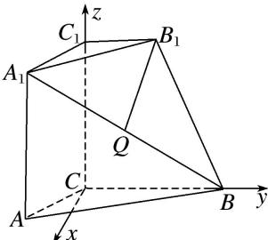

> [!faq]- 《专题08 立体几何中的建系求(设)点问题-立体几何（理科）》例题解析
>
> > [!success]- **【答案】** C
>
> > [!note]- **【解析】**
> > 解析 本题属垂面模型1-1建系类型
> >
> > $\because$ 平面 $A_{1}ACC_{1}\perp$ 平面 $ABC$ ，平面 $A_{1}ACC_{1}\cap$ 平面 $ABC = AC$ ， $CC_{1}\bot AC$ ， $CC_{1}\subset$ 平面 $A_{1}ACC_{1}$ $\therefore CC_1\bot$ 平面 $ABC$ .如图所示，以 $C$ 为原点， $CB$ ， $CC_{1}$ 所在直线分别为 $y$ 轴和 $z$ 轴建立空间直角坐标系，令 $AC = BC = 2B_{1}C_{1} = 2$ ，则 $C(0,0,0),B(0,2,0),C_{1}(0,0,2)$
> >
> > 
> >
> > $A(\sqrt{3}, -1, 0), A_{1}(\sqrt{3}, -1, 2), B_{1}(0, 1, 2), Q(\frac{\sqrt{3}}{2}, \frac{1}{2}, 1).$
