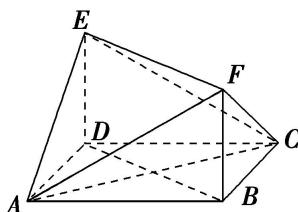

<!-- question-source:start -->
[例 2] (1)在如图所示的多面体中, 四边形 $ABCD$ 是平行四边形, 四边形 $BDEF$ 是矩形, $ED \perp$ 平面 $ABCD$ , $\angle ABD = \frac{\pi}{6}$ , $AB = 2$ , $AD = 1$ , $ED = BD$ . 试建立适当的空间直角坐标系并确定各点坐标.

<!-- question-source:end -->

![[高中/总复习/专题/立体几何/专题08 立体几何中的建系求(设)点问题-立体几何（理科）/专题08_立体几何中的建系求_设_点问题_立体几何_理科_/例题/answers/Q00039679A1.md]]
