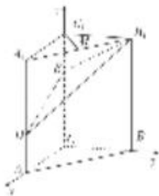
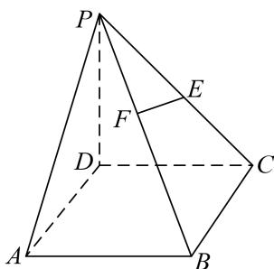
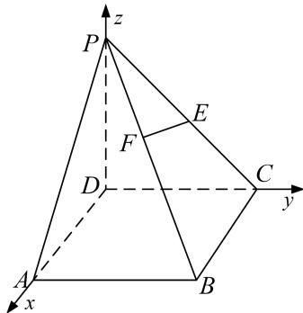
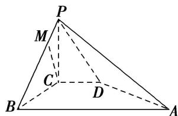
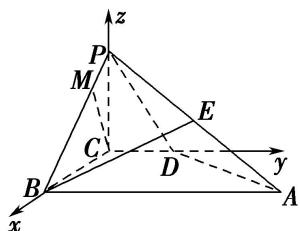
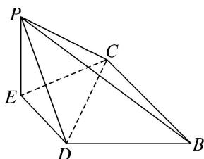

> [!faq]- 《专题08 立体几何中的建系求(设)点问题-立体几何（理科）》例题解析
>
> > [!success]- **【答案】** 详见解析
>
> > [!note]- **【分析】**
> > 本题未单列分析。
>
> > [!note]- **【解析】**
> > (2)如图，在三棱柱 $ABC - A_{1}B_{1}C_{1}$ 中， $CC_{1} \perp$ 平面 $ABC$ ， $AC \perp BC$ ， $AC = BC = 2$ ， $CC_{1} = 3$ ，点 $D$ ， $E$ 分别在棱 $AA_{1}$ 和棱 $CC_{1}$ 上，且 AD=1, CE=2, M 为棱 $A_{1}B_{1}$ 的中点．试建立适当的空间直角坐标系并确定各点坐标.
> > 
> > 解析 本题属墙角模型建系类型
> > 因为 $CC_{1} \perp$ 平面 $ABC, AC \perp BC$ , 所以 $CA, CB, CC_{1}$ 两两垂直. 以 $C$ 为坐标原点, 分别以 $CA, CB, CC_{1}$ 的方向为 $x$ 轴、 $y$ 轴、 $z$ 轴的正方向建立空间直角坐标系(如图),
> > 
> > 可得 $C(0, 0, 0)$ ， $A(2, 0, 0)$ ， $B(0, 2, 0)$ ， $C_{1}(0, 0, 3)$ ， $A_{1}(2, 0, 3)$ ， $B_{1}(0, 2, 3)$ ， $D(2, 0, 1)$ ， $E(0, 0, 2)$ ， $M(1, 1, 3)$ .
> > (3)如图所示，在四棱锥 $P - ABCD$ 中，底面 $ABCD$ 是正方形，侧棱 $PD \perp$ 底面 $ABCD$ ， $PD = DC = 2$ ， $E$ 是 $PC$ 的中点，过点 $E$ 作 $EF \perp PB$ 于点 $F$ 。试建立适当的空间直角坐标系并确定各点坐标。
> > 
> > 解析 本题属墙角模型建系类型
> > 以 D 为坐标原点，射线 DA, DC, DP 分别为 x 轴、y 轴、z 轴的正方向建立如图所示的空间直角坐标系 D-xyz. $D(0, 0, 0)$ , $A(2, 0, 0)$ , $P(0, 0, 2)$ , $C(0, 2, 0)$ , $B(2, 2, 0)$ , $E(0, 1, 1)$ .
> > 
> > $\overrightarrow{PB} = (2, 2, -2)$ ，设 $\overrightarrow{PF} = \lambda \overrightarrow{PB}$ ，则 $\overrightarrow{PF} = (2\lambda, 2\lambda, -2\lambda)$ ， $\overrightarrow{EF} = \overrightarrow{EP} + \overrightarrow{PF} = (2\lambda, 2\lambda - 1, 1 - 2\lambda)$ ，因为 $EF \perp PB$ ，所以 $\overrightarrow{EFPB} = 0$ ，解得， $\lambda = \frac{1}{3}$ ，所以 $F\left(\frac{2}{3}, \frac{2}{3}, \frac{4}{3}\right)$ .
> > (4)如图所示，在四棱锥 $P - ABCD$ 中， $PC \perp$ 平面 $ABCD$ ， $PC = 2$ ，在四边形 $ABCD$ 中， $\angle B = \angle C = 90^\circ$ ， $AB = 4$ ， $CD = 1$ ，点 $E$ 为 $PA$ 的中点，点 $M$ 在 $PB$ 上， $PB = 4PM$ ， $PB$ 与平面 $ABCD$ 成 $30^\circ$ 角，试建立适当的空间直角坐标系并确定各点坐标.
> > 
> > 解析 本题属墙角模型建系类型
> > 由题意知，CB，CD，CP 两两垂直，以 C 为坐标原点，CB 所在直线为 x 轴，CD 所在直线为 y 轴，CP 所在直线为 z 轴建立如图所示的空间直角坐标系 C-xyz.
> > 
> > ∵PC⊥平面ABCD，∴∠PBC为PB与平面ABCD所成的角，∴∠PBC=30°.
> > $\because PC = 2, BC = 2\sqrt{3}, PB = 4, \therefore C(0, 0, 0), B(2\sqrt{3}, 0, 0), D(0, 1, 0), P(0, 0, 2), A(2\sqrt{3}, 4, 0), E(\sqrt{3}, 2, 1), M\left(\frac{\sqrt{3}}{2}, 0, \frac{3}{2}\right),$
> > (5)在 $\triangle ABC$ 中， $D$ ， $E$ 分别为 $AB$ ， $AC$ 的中点， $AB=2BC=2CD=2a$ ，如图①，以 $DE$ 为折痕将 $\triangle ADE$ 折起，点 $A$ 到达点 $P$ 的位置，使平面 $DEP\perp$ 平面 $BCED$ ，如图②．试建立适当的空间直角坐标系并确定各点坐标．
> > 
> > 图①
> > 
> > 图②
> > 解析 本题属墙角模型建系类型
> > 在题图①中，因为 AB=2BC=2CD，且 D 为 AB 的中点，
> > 所以由平面几何知识，得 $\angle ACB=90^{\circ}$ 。又 E 为 AC 的中点，所以 $DE \parallel BC$ 。
> > 在题图②中， $CE \perp DE$ ， $PE \perp DE$ ，因为平面 $DEP \perp$ 平面 BCED，平面 $DEP \cap$ 平面 BCED = DE， $EP \subset$ 平面 DEP， $EP \perp DE$ ，所以 $EP \perp$ 平面 BCED。又 $CE \subset$ 平面 BCED，所以 $EP \perp CE$ 。
> > 
> > 以 E 为坐标原点， $\overrightarrow{ED},\overrightarrow{EC},\overrightarrow{EP}$ 的方向分别为 x 轴，y 轴，z 轴的正方向建立如图所示的空间直角坐标系。在题图①中，设 BC=2a，则 AB=4a， $AC=2\sqrt{3}a,\quad AE=CE=\sqrt{3}a,\quad DE=a$ 。
> > 则 $P(0, 0, \sqrt{3}a)$ ， $D(a, 0, 0)$ ， $C(0, \sqrt{3}a, 0)$ ， $B(2a, \sqrt{3}a, 0)$ .
> > ## 【对点训练】
