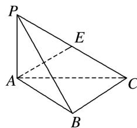
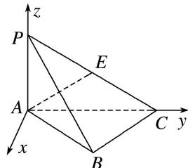
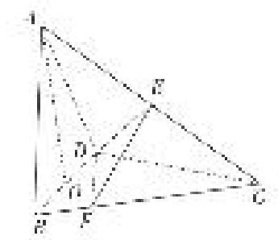
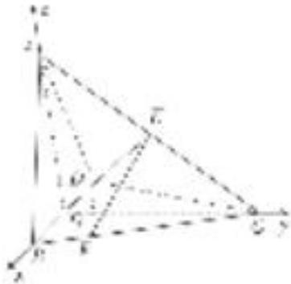
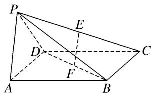
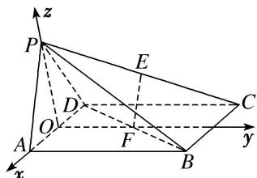
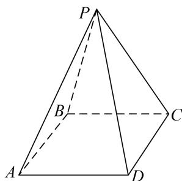

> [!faq]- 《专题08 立体几何中的建系求(设)点问题-立体几何（理科）》例题解析
>
> > [!success]- **【答案】** 详见解析
>
> > [!note]- **【分析】**
> > 本题未单列分析。
>
> > [!note]- **【解析】**
> > 解析 本题属垂面模型1-1建系类型
> > 在 $\triangle ABD$ 中， $\angle ABD=\frac{\pi}{6}$ ， $AB=2$ ， $AD=1$ ，由余弦定理，得 $BD=\sqrt{3}$ ，从而 $BD^{2}+AD^{2}=AB^{2}$ ，故 $BD \perp AD$ ，所以 $\triangle ABD$ 为直角三角形且 $\angle ADB=\frac{\pi}{2}$ 。因为 $DE \perp$ 平面 $ABCD$ ， $BD \perp AD$ ，
> > 
> > 所以以点 D 为坐标原点，DA，DB，DE 所在直线分别为 x 轴，y 轴，z 轴建立空间直角坐标系，如图所示．则 $D(0,0,0)$ ， $A(1,0,0)$ ， $B(0,\sqrt{3},0)$ ， $E(0,0,\sqrt{3})$ ， $C(-1,\sqrt{3},0)$ ， $F(0,\sqrt{3},\sqrt{3})$ .
> > (2)如图, 直四棱柱 $ABCD - A_{1}B_{1}C_{1}D_{1}$ 的底面是菱形, $AA_{1} = 4$ , $AB = 2$ , $\angle BAD = 60^{\circ}$ , $E$ , $M$ , $N$ 分别是 $BC$ , $BB_{1}$ , $A_{1}D$ 的中点. 试建立适当的空间直角坐标系并确定各点坐标.
> > 
> > 解析 本题属垂面模型1-1建系类型
> > 由已知可得 $DE \perp DA$ ，以 D 为坐标原点， $\overrightarrow{DA}$ 的方向为 x 轴正方向，建立如图所示的空间直角坐标系 Dxyz，
> > 
> > 则 $D(0, 0, 0)$ ， $A(2, 0, 0)$ ， $E(0, \sqrt{3}, 0)$ ， $B(1, \sqrt{3}, 0)$ ， $C(-1, \sqrt{3}, 0)$ ， $D_{1}(0, 0, 4)$ ， $A_{1}(2, 0, 4)$ ， $B_{1}(1, \sqrt{3}, 4)$ ， $C_{1}(-1, \sqrt{3}, 4)$ ， $M(1, \sqrt{3}, 2)$ ， $N(1, 0, 2)$ ，
> > (3)如图，已知三棱锥 $P - ABC$ ，平面 $PAC \perp$ 平面 $ABC$ ， $AB = BC = PA = \frac{1}{2} PC = 2$ ， $\angle ABC = 120^{\circ}$ 。试建立适当的空间直角坐标系并确定各点坐标.
> > 
> > ## 解析 本题属垂面模型1-1建系类型
> > $AB = BC = 2$ ， $\angle ABC = 120^{\circ}$ ，由余弦定理得
> > $AC^{2} = AB^{2} + BC^{2} - 2AB\cdot BC\cdot \cos \angle ABC = 4 + 4 - 2\times 2\times 2\times \left(-\frac{1}{2}\right) = 12$ ，故 $AC = 2\sqrt{3}$
> > 又 $PA^{2}+AC^{2}=4+12=16=PC^{2}$ ，故 $PA\perp AC$ .
> > 又平面 $PAC \perp$ 平面 $ABC$ ，且平面 $PAC \cap$ 平面 $ABC = AC$ ，故 $PA \perp$ 平面 $ABC$ 。所以是垂面模型的情形 1，故以 $A$ 为坐标原点，建立如图所示的空间直角坐标系 $A - xyz$ 。
> > 
> > 则 $A(0, 0, 0)$ ， $B(1, \sqrt{3}, 0)$ ， $P(0, 0, 2)$ ， $C(0, 2\sqrt{3}, 0)$ ， $E(0, \sqrt{3}, 1)$ .
> > (4)在三棱锥 A-BCD 中，已知 $CB=CD=\sqrt{5}$ ，BD=2，O 为 BD 的中点， $AO \perp$ 平面 BCD，AO=2，E 为 AC 的中点．若点 F 在 BC 上，满足 $BF=\frac{1}{4}BC$ ，试建立适当的空间直角坐标系并确定各点坐标.
> > 
> > 连接 $CO$ ， $\because CB=CD$ ， $BO=OD$ ， $\therefore CO \perp BD$ 。又 $AO \perp$ 平面 $BCD$ ， $\therefore AO$ ， $BO$ ， $CO$ 两两垂直。以 $O$ 为坐标原点， $OB$ ， $OC$ ， $OA$ 所在直线分别为 $x$ ， $y$ ， $z$ 轴建立空间直角坐标系，
> > 
> > 则 $O(0, 0, 0)$ ， $A(0, 0, 2)$ ， $B(1, 0, 0)$ ， $C(0, 2, 0)$ ， $D(-1, 0, 0)$ ， $E(0, 1, 1)$ 。因为 $BF=\frac{1}{4}BC$ ，
> > 所以 $\overrightarrow{BF}=\frac{1}{4}\overrightarrow{BC}=(-\frac{1}{4},\frac{1}{2},0)$ ，所以 $F(\frac{3}{4},\frac{1}{2},0)$ ,
> > (5)如图, 在四棱锥 $P - ABCD$ 中, 底面 $ABCD$ 是边长为 $a$ 的正方形, 侧面 $PAD \perp$ 底面 $ABCD$ , 且 $PA = PD = \frac{\sqrt{2}}{2} AD$ , 设 $E, F$ 分别为 $PC, BD$ 的中点. 试建立适当的空间直角坐标系并确定各点坐标.
> > 
> > ## 解析 本题属垂面模型1-2建系类型
> > 如图，取 AD 的中点 O，连接 OP，OF。因为 PA=PD，所以 $PO \perp AD$ 。
> > 因为侧面 $PAD \perp$ 底面 ABCD，平面 $PAD \cap$ 平面 ABCD = AD， $PO \subset$ 平面 PAD，所以 $PO \perp$ 平面 ABCD.
> > $$
> > O F \perp A D
> > $$
> > 因为 $PA=PD=\frac{\sqrt{2}}{2}AD$ ，所以 $PA\perp PD$ ， $OP=OA=\frac{a}{2}$ .
> > 
> > 以 O 为原点，OA，OF，OP 所在直线分别为 x 轴，y 轴，z 轴建立空间直角坐标系，
> > $$
> > \text {则} A \left[ \frac {a}{2}, 0, 0 \right], F \left[ 0, \frac {a}{2}, 0 \right], D \left[ - \frac {a}{2}, 0, 0 \right], P \left[ 0, 0, \frac {a}{2} \right], B \left[ \frac {a}{2}, a, 0 \right], C \left[ - \frac {a}{2}, a, 0 \right].
> > $$
> > 因为 E 为 PC 的中点，所以 $E\left(-\frac{a}{4}, \frac{a}{2}, \frac{a}{4}\right)$ .
> > (6)已知四棱锥 P-ABCD，底面 ABCD 为菱形，PD=PB， $PA=PC=\sqrt{3}AB$ ，PA 与平面 ABCD 所成的角为 $60^{\circ}$ ，PA=2，试建立适当的空间直角坐标系并确定各点坐标.
> > 
> > 解析 本题属垂面模型1-3建系类型
> > 连接 AC，BD 且 $AC \cap BD = O$ ，连接 PO。由已知 ABCD 为菱形，所以 $BD \perp AC$ ，又 PD = PB，
> > 所以 $PO \perp BD$ 。因为 $PA = PC$ ，所以 $PO \perp AC$ ，所以 $PO \perp$ 平面 $ABCD$ ，所以 $PA$ 与平面 $ABCD$ 所成的角为 $\angle PAO$ ，所以 $\angle PAO = 60^\circ$ ，所以 $AO = \frac{1}{2} PA = 1$ ， $PO = \frac{\sqrt{3}}{2} PA = \sqrt{3}$ 。因为 $PA = \sqrt{3} AB$ ，所以 $BO = \frac{\sqrt{3}}{6} PA = \frac{\sqrt{3}}{3}$ 。以 $O$ 为原点， $OA$ ， $OD$ ， $OP$ 分别为 $x$ 轴、 $y$ 轴、 $z$ 轴建立如图所示空间直角坐标系。
> > 
> > 则 $O(0, 0, 0), A(1, 0, 0), D\left[0, \frac{\sqrt{3}}{3}, 0\right], B\left[0, -\frac{\sqrt{3}}{3}, 0\right], C(-1, 0, 0), P(0, 0, \sqrt{3}).$
> > (7)如图, 正方形 $ABCD$ 的边长为 $2 \sqrt{2}$ , 四边形 $BDEF$ 是平行四边形, $BD$ 与 $AC$ 交于点 $G$ , $O$ 为 $GC$ 的中点, $FO = \sqrt{3}$ , 且 $FO \perp$ 平面 $ABCD$ . 试建立适当的空间直角坐标系并确定各点坐标.
> > 
> > 解析 本题属垂面模型1-3建系类型
> > 如图，取 BC 的中点 H，连接 OH，则 $OH \parallel BD$ ，又四边形 ABCD 为正方形，
> > 
> > $\therefore AC \perp BD, \therefore OH \perp AC,$ 故以 O 为原点，建立如图所示的直角坐标系，
> > 则 $O(0, 0, 0)$ ， $A(3, 0, 0)$ ， $C(-1, 0, 0)$ ， $G(1, 0, 0)$ ， $F(0, 0, \sqrt{3})$ ， $D(1, -2, 0)$ ， $B(1, 2, 0)$ ， $E(0, -4, \sqrt{3})$ ，
> > (8)如图，棱柱 $ABCD-A_{1}B_{1}C_{1}D_{1}$ 的所有棱长都等于 2， $\angle ABC$ 和 $\angle A_{1}AC$ 均为 $60^{\circ}$ ，平面 $AA_{1}C_{1}C \perp$ 平面 ABCD，试建立适当的空间直角坐标系并确定各点坐标.
> > 
> > 解析 本题属垂面模型1-3建系类型
> > 设 BD 与 AC 交于点 O，则 $BD \perp AC$ ，连接 $A_{1}O$ ，在 $\triangle AA_{1}O$ 中， $AA_{1}=2, AO=1, \angle A_{1}AO=60^{\circ}, \therefore A_{1}O^{2}=AA_{1}^{2}+AO^{2}-2AA_{1}\cdot AO\cos60^{\circ}=3, \therefore AO^{2}+A_{1}O^{2}=AA_{1}^{2}, \therefore A_{1}O \perp AO.$
> > 
> > 由于平面 $AA_{1}C_{1}C \perp$ 平面 ABCD，且平面 $AA_{1}C_{1}C \cap$ 平面 ABCD = AC， $A_{1}O \subset$ 平面 $AA_{1}C_{1}C$ ，
> > $\therefore A_{1}O \perp$ 平面 $ABCD$ 。以 $OB, OC, OA_{1}$ 所在直线分别为 $x$ 轴， $y$ 轴， $z$ 轴，建立如图所示的空间直角坐标系，则 $B(\sqrt{3}, 0, 0), C(0, 1, 0), A_{1}(0, 0, \sqrt{3}), A(0, -1, 0), D(-\sqrt{3}, 0, 0), C_{1}(0, 2, \sqrt{3}), B_{1}(\sqrt{3}, 1, \sqrt{3}), D_{1}(-\sqrt{3}, 1, \sqrt{3})$
> > (9)如图，已知四棱锥 $P - ABCD$ ， $\triangle PAD$ 是以 $AD$ 为斜边的等腰直角三角形， $BC / / AD$ ， $CD\bot AD$ ， $PC = AD = 2DC = 2CB = 2$ ， $E$ 为 $PD$ 的中点．试建立适当的空间直角坐标系并确定各点坐标.
> > 
> > 解析 本题属垂面模型2-1建系类型
> > 设 AD 的中点为 O，连接 OB，OP．∵△PAD 是以 AD 为斜边的等腰直角三角形，
> > ∴OP⊥AD．∵BC= $\frac{1}{2}$ AD=OD，且 BC//OD，
> > 
> > ∴四边形 BCDO 为平行四边形，又∵CD⊥AD，∴OB⊥AD，∵OP∩OB=O，∴AD⊥平面 OPB. 所以是垂面模型的情形 3，过点 O 在平面 POB 内作 OB 的垂线 OM，交 PB 于 M，
> > 以 O 为原点，OB 所在直线为 x 轴，OD 所在直线为 y 轴，OM 所在直线为 z 轴，建立空间直角坐标系，如图．则有 $A(0, -1, 0)$ ， $B(1, 0, 0)$ ， $C(1, 1, 0)$ ， $D(0, 1, 0)$ ．设 $P(x, 0, z)(z > 0)$ ，由 PC = 2，
> > $OP = 1$ ，得 $\left\{ \begin{array}{l}(x - 1)^2 +1 + z^2 = 4,\\ x^2 +z^2 = 1, \end{array} \right.$ 得 $x = -\frac{1}{2},z = \frac{\sqrt{3}}{2}$ 即点 $P\left(-\frac{1}{2},0,\frac{\sqrt{3}}{2}\right)$ 而 $E$ 为 $PD$ 的中点，： $E\left(-\frac{1}{4},\frac{1}{2},\frac{\sqrt{3}}{4}\right).$
> > (10)如图所示的几何体中，四边形 $ABCD$ 是等腰梯形， $AB \parallel CD$ ， $\angle ABC = 60^\circ$ ， $AB = 2BC = 2CD = 4$ ，四边形 $DCEF$ 是正方形， $N$ ， $G$ 分别是线段 $AB$ ， $CE$ 的中点，且二面角 $A - CD - F$ 的大小为 $120^\circ$ 。试建立适当的空间直角坐标系并确定各点坐标。
> > 
> > ## 解析 本题属垂面模型3-1建系类型
> > 设 $CD$ 的中点为 $O$ , $EF$ 的中点为 $P$ , 连接 $NO$ , $OP$ , 易得 $NO \perp CD$ , 以点 $O$ 为原点, 以 $OC$ 所在直线为 $x$ 轴, 以 $NO$ 所在直线为 $y$ 轴, 以过点 $O$ 且与平面 $ABCD$ 垂直的直线为 $z$ 轴建立如图所示的空间直角坐标系.
> > 
> > 因为 $NO \perp CD$ ， $OP \perp CD$ ，所以 $\angle NOP$ 是二面角 $A - CD - F$ 的平面角，则 $\angle NOP = 120^{\circ}$ 所以 $\angle POy = 60^{\circ}$ ，因为 $AB = 4$ ，则 $BC = CD = 2$ ，则 $C(1, 0, 0)$ ， $D(-1, 0, 0)$ ， $B(2, -\sqrt{3}, 0)$ ， $A(-2, -\sqrt{3}, 0)$ ， $N(0, -\sqrt{3}, 0)$ ， $E(1, 1, \sqrt{3})$ ， $F(-1, 1, \sqrt{3})$ ， $P(0, 1, \sqrt{3})$
> > ## 【对点训练】
