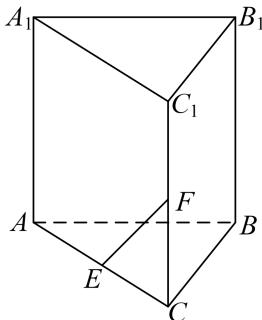

<!-- question-source:start -->
1. 已知直三棱柱 $ABC - A_{1}B_{1}C_{1}$ 中，侧面 $AA_{1}B_{1}B$ 为正方形， $AB = BC = 2$ ， $E$ ， $F$ 分别为 $AC$ 和 $CC_{1}$ 的中点，试建立适当的空间直角坐标系并确定各点坐标。

## 1. 解析 本题属墙角模型建系类型

连接 AF，∵ E，F 分别为直三棱柱 $ABC-A_{1}B_{1}C_{1}$ 的棱 AC 和 $CC_{1}$ 的中点，且 AB=BC=2，
<!-- question-source:end -->

![[高中/总复习/专题/立体几何/专题08 立体几何中的建系求(设)点问题-立体几何（理科）/专题08_立体几何中的建系求_设_点问题_立体几何_理科_/对点训练/answers/Q00039674A1.md]]
