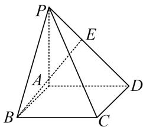

<!-- question-source:start -->
4. 在四棱锥 $P - ABCD$ 中，底面 $ABCD$ 为矩形， $PA \perp$ 平面 $ABCD$ ， $AD = 2AB = 4$ ， $PD$ 与底面 $ABCD$ 所成的角为 $45^{\circ}$ ，且 $BE \perp DP$ ，试建立适当的空间直角坐标系并确定各点坐标。

<!-- question-source:end -->

![[高中/总复习/专题/立体几何/专题08 立体几何中的建系求(设)点问题-立体几何（理科）/专题08_立体几何中的建系求_设_点问题_立体几何_理科_/对点训练/answers/Q00039677A1.md]]
