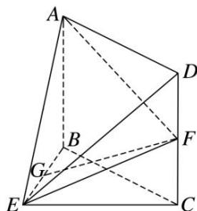

<!-- question-source:start -->
3. 如图，在几何体 $ABCDE$ 中，四边形 $ABCD$ 是矩形， $AB \perp$ 平面 $BEC$ ， $BE \perp EC$ ， $AB = BE = EC = 2$ ， $G$ ， $F$ 分别是线段 $BE$ ， $DC$ 的中点，试建立适当的空间直角坐标系并确定各点坐标。

<!-- question-source:end -->

![[高中/总复习/专题/立体几何/专题08 立体几何中的建系求(设)点问题-立体几何（理科）/专题08_立体几何中的建系求_设_点问题_立体几何_理科_/对点训练/answers/Q00039682A1.md]]
