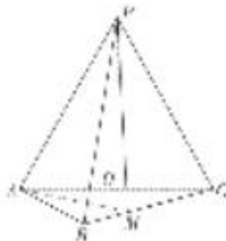
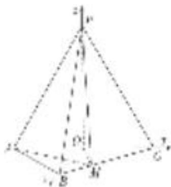

<!-- question-source:start -->
4. 如图，在三棱锥 $P - ABC$ 中， $AB = BC = 2\sqrt{2}$ ， $PA = PB = PC = AC = 4$ ， $O$ 为 $AC$ 的中点。若点 $M$ 在棱 $BC$ 上，且 $PM \perp BC$ ，试建立适当的空间直角坐标系并确定各点坐标。

## 4. 解析 本题属垂面模型1-2建系类型

因为 PA=PC=AC=4，O 为 AC 的中点，所以 $PO \perp AC$ ，且 $PO=2\sqrt{3}$ .

连接 OB．因为 $AB=BC=\frac{\sqrt{2}}{2}AC$ ，所以 $\triangle ABC$ 为等腰直角三角形，且 $OB\perp AC, OB=\frac{1}{2}AC=2$ 。
由 $PO^{2}+OB^{2}=PB^{2}$ ，知 $PO\perp OB$ ．由 $PO\perp OB, PO\perp AC, AC\cap OB=O$ ，知 $PO\perp$ 平面 ABC.

如图，以 O 为坐标原点， $\overrightarrow{OB},\overrightarrow{OC},\overrightarrow{OP}$ 的方向分别为 x 轴、y 轴、z 轴正方向，建立如图所示的空间直角坐标系 Oxyz．由已知得 $O(0,0,0)$ ， $B(2,0,0)$ ， $A(0,-2,0)$ ， $C(0,2,0)$ ， $P(0,0,2\sqrt{3})$ ，设 $M(a,2-a,0)(0<a\leq2)$ ，则 $\overrightarrow{PM}=(a,2-a,-2\sqrt{3})$ ．因为 $\overrightarrow{BC}=(-2,2,0)$ ，又因为 $PM\perp BC$ ，所以 $\overrightarrow{PMB}\overrightarrow{C}=0$ ，解得，a=1，所以 $M(1,1,0)$ .
<!-- question-source:end -->
