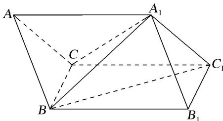

<!-- question-source:start -->
10. 斜三棱柱 $ABC-A_{1}B_{1}C_{1}$ 中，底面是边长为 2 的正三角形， $A_{1}B=\sqrt{7}$ ， $\angle A_{1}AB=\angle A_{1}AC=60^{\circ}$ ，试建立适当的空间直角坐标系并确定各点坐标.

<!-- question-source:end -->

![[高中/总复习/专题/立体几何/专题08 立体几何中的建系求(设)点问题-立体几何（理科）/专题08_立体几何中的建系求_设_点问题_立体几何_理科_/对点训练/answers/Q00039687A1.md]]
