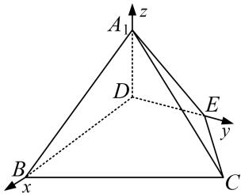

> [!faq]- 《专题08 立体几何中的建系求(设)点问题-立体几何（理科）》例题解析
>
> > [!success]- **【答案】** 详见解析
>
> > [!note]- **【分析】**
> > 本题未单列分析。
>
> > [!note]- **【解析】**
> > 解析 本题属墙角模型建系类型
> > 题图①中，由已知可得：AE=2，AD=1， $A=60^{\circ}$
> > 从而 $DE=\sqrt{1^{2}+2^{2}-2\times1\times2\times\cos60^{\circ}}=\sqrt{3}$ . 故得 $AD^{2}+DE^{2}=AE^{2}$ ,
> > 所以 $AD \perp DE$ ， $BD \perp DE$ ．所以题图②中， $A_{1}D \perp DE$ ，
> > 又平面 $ADE \cap$ 平面 BCED = DE, $A_{1}D \perp DE$ , $A_{1}D \subset$ 平面 $A_{1}DE$ , 所以 $A_{1}D \perp$ 平面 BCED.
> > 以 D 为坐标原点，以射线 DB，DE， $DA_{1}$ 分别为 x 轴，y 轴，z 轴的正半轴建立空间直角坐标系 D-xyz，如图，
> > 
> > 易知 $D(0, 0, 0)$ ， $B(2, 0, 0)$ ， $E(0, \sqrt{3}, 0)$ ， $A_{1}(0, 0, 1)$ ， $C(\frac{1}{2}, \frac{3\sqrt{3}}{2}, 0)$ .
