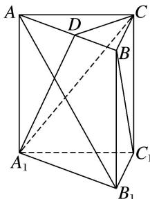

<!-- question-source:start -->
[例 1] 如图，已知在直三棱柱 $ABC-A_{1}B_{1}C_{1}$ 中， $AC \perp BC$ ，D 为 AB 的中点， $AC = BC = BB_{1}$ .

(1)求证： $BC_{1}\bot AB_{1}$

(2)求证： $BC_{1}$ // 平面 $CA_{1}D$ .

(1) $\because \overrightarrow{BC_1} = (0, -2, -2), \overrightarrow{AB_1} = (-2, 2, -2), \therefore \overrightarrow{BC_1} \cdot \overrightarrow{AB_1} = 0 - 4 + 4 = 0, \therefore \overrightarrow{BC_1} \perp \overrightarrow{AB_1}, \therefore BC_1 \perp AB_1.$

(2)取 $A_{1}C$ 的中点 $E$ , $\because E(1, 0, 1)$ , $\therefore \overrightarrow{ED} = (0, 1, 1)$ , 又 $\overrightarrow{BC}_{1} = (0, -2, -2)$ , $\therefore \overrightarrow{ED} = -\frac{1}{2}\overrightarrow{BC}_{1}$ , 且 $ED$ 和 $BC_{1}$ 不重合, 则 $ED // BC_{1}$ . 又 $ED \subset$ 平面 $CA_{1}D$ , $BC_{1} \notin$ 平面 $CA_{1}D$ , 故 $BC_{1} //$ 平面 $CA_{1}D$ .
<!-- question-source:end -->

![[高中/总复习/专题/立体几何/专题09 利用空间向量证明平行与垂直问题-立体几何（理科）/专题09_利用空间向量证明平行与垂直问题/例题/answers/Q00039688A1.md]]
