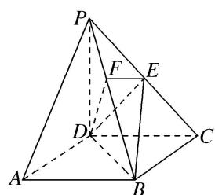

<!-- question-source:start -->
[例 2] 如图所示，在四棱锥 P-ABCD 中，底面 ABCD 是正方形，侧棱 $PD \perp$ 底面 ABCD，PD = DC，E 是 PC 的中点，过点 E 作 $EF \perp PB$ 于点 F．求证：

(1) $PA \parallel$ 平面 EDB;

(2) $PB \perp$ 平面 EFD.

(1)连接 $AC$ 交 $BD$ 于点 $G$ , 连接 $EG$ . 依题意得 $A(a,0,0)$ , $P(0,0,a)$ , $C(0,a,0)$ , $E\left[\begin{array}{lll}0, & \frac{a}{2}, & \frac{a}{2}\end{array}\right]$ . 因为底面 $ABCD$ 是正方形, 所以 $G$ 为 $AC$ 的中点, 故点 $G$ 的坐标为 $\left[\frac{a}{2}, \frac{a}{2}, 0\right]$ , 所以 $\overrightarrow{PA} = (a,0,-a)$ , $\overrightarrow{EG} = \left[\frac{a}{2}, 0, -\frac{a}{2}\right]$ , 则 $\overrightarrow{PA} = 2\overrightarrow{EG}$ , 故 $PA // EG$ . 而 $EG \subset$ 平面 $EDB$ , $PA \notin$ 平面 $EDB$ , 所以 $PA //$ 平面 $EDB$ .

(2)依题意得 $B(a, a, 0)$ ，所以 $\overrightarrow{PB} = (a, a, -a)$ 。又 $\overrightarrow{DE} = \begin{pmatrix} 0, & \frac{a}{2}, & \frac{a}{2} \end{pmatrix}$ ，故 $\overrightarrow{PB} \cdot \overrightarrow{DE} = 0 + \frac{a^2}{2} - \frac{a^2}{2} = 0$ ，所以 $PB \perp DE$ ，所以 $PB \perp DE$ 。由题可知 $EF \perp PB$ ，且 $EF \cap DE = E$ ，所以 $PB \perp$ 平面 $EFD$ .
<!-- question-source:end -->

![[高中/总复习/专题/立体几何/专题09 利用空间向量证明平行与垂直问题-立体几何（理科）/专题09_利用空间向量证明平行与垂直问题/例题/answers/Q00039689A1.md]]
