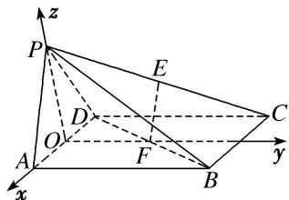

<!-- question-source:start -->
[例 6] 如图，在四棱锥 P-ABCD 中，底面 ABCD 是边长为 a 的正方形，侧面 PAD⊥底面 ABCD，且 $PA=PD=\frac{\sqrt{2}}{2}AD$ ，设 E，F 分别为 PC，BD 的中点.

(1)求证： $EF \parallel$ 平面 PAD;

(2)求证：平面 $PAB \perp$ 平面 PDC.

(1)如图, 取 ${AD}$ 的中点 $O$ ,连接 ${OP},{OF}$ . 因为 ${PA} = {PD}$ ,所以 ${PO} \bot  {AD}$ .

因为侧面 $PAD \perp$ 底面 ABCD，平面 $PAD \cap$ 平面 ABCD = AD，

$PO \subset$ 平面 PAD，所以 $PO \perp$ 平面 ABCD。又 O，F 分别为 AD，BD 的中点，所以 OF // AB。

又 ABCD 是正方形，所以 $OF \perp AD$ 。因为 $PA = PD = \frac{\sqrt{2}}{2} AD$ ，所以 $PA \perp PD$ ， $OP = OA = \frac{a}{2}$

以 O 为原点，OA，OF，OP 所在直线分别为 x 轴，y 轴，z 轴建立空间直角坐标系，

则 $A\left(\frac{a}{2}, 0, 0\right), F\left(0, \frac{a}{2}, 0\right), D\left(-\frac{a}{2}, 0, 0\right), P\left(0, 0, \frac{a}{2}\right), B\left(\frac{a}{2}, a, 0\right), C\left(-\frac{a}{2}, a, 0\right)$ .

因为 E 为 PC 的中点，所以 $E\left(-\frac{a}{4}, \frac{a}{2}, \frac{a}{4}\right)$ . 易知平面 PAD 的一个法向量为 $\overrightarrow{OF}=\left(0, \frac{a}{2}, 0\right)$ ，
因为 $\overrightarrow{EF}=\left(\frac{a}{4},0,-\frac{a}{4}\right)$ ，且 $\overrightarrow{OF}\cdot\overrightarrow{EF}=\left(0,\frac{a}{2},0\right)\cdot\left(\frac{a}{4},0,-\frac{a}{4}\right)=0,$

又因为 $EF \not\subset$ 平面 PAD，所以 $EF \parallel$ 平面 PAD.

(2)因为 $\overrightarrow{PA} = \left[\frac{a}{2}, 0, -\frac{a}{2}\right]$ , $\overrightarrow{CD} = (0, -a, 0)$ , 所以 $\overrightarrow{PA} \cdot \overrightarrow{CD} = \left[\frac{a}{2}, 0, -\frac{a}{2}\right] \cdot (0, -a, 0) = 0$ , 所以 $\overrightarrow{PA} \perp \overrightarrow{CD}$ , 所以 $PA \perp CD$ . 又 $PA \perp PD$ , $PD \cap CD = D$ , $PD$ , $CD \subset$ 平面 $PDC$ , 所以 $PA \perp$ 平面 $PDC$ . 又 $PA \subset$ 平面 $PAB$ , 所以平面 $PAB \perp$ 平面 $PDC$ .

## 【对点训练】
<!-- question-source:end -->

![[高中/总复习/专题/立体几何/专题09 利用空间向量证明平行与垂直问题-立体几何（理科）/专题09_利用空间向量证明平行与垂直问题/例题/answers/Q00043611A1.md]]
