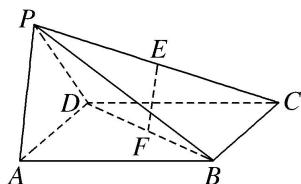

<!-- question-source:start -->
[例 6] 如图，在四棱锥 P-ABCD 中，底面 ABCD 是边长为 a 的正方形，侧面 PAD⊥底面 ABCD，且 $PA=PD=\frac{\sqrt{2}}{2}AD$ ，设 E，F 分别为 PC，BD 的中点.

(1)求证： $EF \parallel$ 平面 PAD;

(2)求证：平面 $PAB \perp$ 平面 PDC.

<!-- question-source:end -->

![[高中/总复习/专题/立体几何/专题09 利用空间向量证明平行与垂直问题-立体几何（理科）/专题09_利用空间向量证明平行与垂直问题/例题/answers/Q00043611A1.md]]
