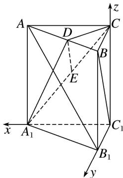

> [!faq]- 《专题09 利用空间向量证明平行与垂直问题-立体几何（理科）》例题解析
>
> > [!success]- **【答案】** 详见解析
>
> > [!note]- **【解析】**
> > 解析 如图，以 $C_1$ 点为原点， $C_1A_1$ ， $C_1B_1$ ， $C_1C$ 所在直线分别为 $x$ 轴， $y$ 轴， $z$ 轴建立空间直角坐标系.
> >
> > 
> >
> > 设 $AC=BC=BB_{1}=2$ ，则 $A(2,0,2)$ ， $B(0,2,2)$ ， $C(0,0,2)$ ， $A_{1}(2,0,0)$ ， $B_{1}(0,2,0)$ ， $C_{1}(0,0,0)$ ， $D(1,1,2)$ .
> >
> > (1) $\because \overrightarrow{BC_1} = (0, -2, -2), \overrightarrow{AB_1} = (-2, 2, -2), \therefore \overrightarrow{BC_1} \cdot \overrightarrow{AB_1} = 0 - 4 + 4 = 0, \therefore \overrightarrow{BC_1} \perp \overrightarrow{AB_1}, \therefore BC_1 \perp AB_1.$
> >
> > (2)取 $A_{1}C$ 的中点 $E$ , $\because E(1, 0, 1)$ , $\therefore \overrightarrow{ED} = (0, 1, 1)$ , 又 $\overrightarrow{BC}_{1} = (0, -2, -2)$ , $\therefore \overrightarrow{ED} = -\frac{1}{2}\overrightarrow{BC}_{1}$ , 且 $ED$ 和 $BC_{1}$ 不重合, 则 $ED // BC_{1}$ . 又 $ED \subset$ 平面 $CA_{1}D$ , $BC_{1} \notin$ 平面 $CA_{1}D$ , 故 $BC_{1} //$ 平面 $CA_{1}D$ .
