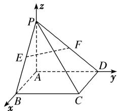

> [!faq]- 《专题09 利用空间向量证明平行与垂直问题-立体几何（理科）》例题解析
>
> > [!success]- **【答案】** 详见解析
>
> > [!note]- **【解析】**
> > 解析
> > (1)以点 $A$ 为原点, $AB$ 所在直线为 $x$ 轴, $AD$ 所在直线为 $y$ 轴, $AP$ 所在直线为 $z$ 轴, 建立如图所示的空间直角坐标系. 则 $A(0, 0, 0)$ , $B(1, 0, 0)$ , $C(1, 2, 0)$ , $D(0, 2, 0)$ , $P(0, 0, 1)$ .
> >
> > 
> >
> > 点 E, F 分别是 PB, PD 的中点, $F\left(0, 1, \frac{1}{2}\right)$ , $E\left(\frac{1}{2}, 0, \frac{1}{2}\right)$ .
> >
> > $\overrightarrow{FE}=\left(\frac{1}{2},-1,0\right),\quad\overrightarrow{BD}=(-1,2,0),\quad\overrightarrow{FE}=-\frac{1}{2}\overrightarrow{BD}.$ 即 $EF \parallel BD.$
> >
> > 又 $BD \subset$ 平面 ABCD， $EF \notin$ 平面 ABCD，所以 $EF \parallel$ 平面 ABCD.
> >
> > (2)由
> > (1)可知 $\overrightarrow{PB}=(1,0,-1)$ ， $\overrightarrow{PD}=(0,2,-1)$ ， $\overrightarrow{AP}=(0,0,1)$ ， $\overrightarrow{AD}=(0,2,0)$ ， $\overrightarrow{DC}=(1,0,0)$ ，
> > 因为 $\overrightarrow{AP}\cdot\overrightarrow{DC}=(0,0,1)\cdot(1,0,0)=0,\quad\overrightarrow{AD}\cdot\overrightarrow{DC}=(0,2,0)\cdot(1,0,0)=0,$
> >
> > 所以 $\overrightarrow{AP}\perp\overrightarrow{DC},\quad\overrightarrow{AD}\perp\overrightarrow{DC}$ ，即 $AP\perp DC,\quad AD\perp DC.$
> >
> > 又 $AP \cap AD = A$ ，所以 $DC \perp$ 平面 PAD。因为 $DC \subset$ 平面 PDC，所以平面 $PAD \perp$ 平面 PDC。
