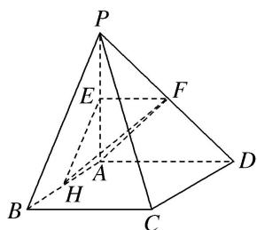

<!-- question-source:start -->
2. 如图，四棱锥 $P - ABCD$ 的底面为正方形，侧棱 $PA \perp$ 底面 $ABCD$ ，且 $PA = AD = 2$ ， $E$ ， $F$ ， $H$ 分别是线

段 PA, PD, AB 的中点．求证：

(1)PB//平面 EFH;

(2) $PD \perp$ 平面 AHF.

<!-- question-source:end -->

![[高中/总复习/专题/立体几何/专题09 利用空间向量证明平行与垂直问题-立体几何（理科）/专题09_利用空间向量证明平行与垂直问题/对点训练/answers/Q00039695A1.md]]
