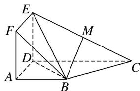

<!-- question-source:start -->
3. 如图，正方形 ADEF 与梯形 ABCD 所在的平面互相垂直， $AD \perp CD$ ， $AB \parallel CD$ ，AB = AD = 2，CD = 4，M 为 CE 的中点.

(1)求证： $BM \parallel$ 平面 ADEF;

(2)求证： $BC \perp$ 平面 BDE.

<!-- question-source:end -->

![[高中/总复习/专题/立体几何/专题09 利用空间向量证明平行与垂直问题-立体几何（理科）/专题09_利用空间向量证明平行与垂直问题/对点训练/answers/Q00039696A1.md]]
