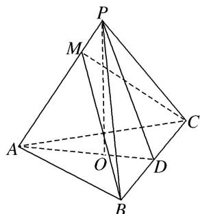

<!-- question-source:start -->
4. 如图，在三棱锥 $P - ABC$ 中， $AB = AC$ ， $D$ 为 $BC$ 的中点， $PO \perp$ 平面 $ABC$ ，垂足 $O$ 落在线段 $AD$ 上．已知 $BC = 8$ ， $PO = 4$ ， $AO = 3$ ， $OD = 2$ ．

(1)证明： $AP\bot BC$

(2)若点 M 是线段 AP 上一点，且 AM=3．试证明平面 $AMC \perp$ 平面 BMC.

<!-- question-source:end -->

![[高中/总复习/专题/立体几何/专题09 利用空间向量证明平行与垂直问题-立体几何（理科）/专题09_利用空间向量证明平行与垂直问题/对点训练/answers/Q00043612A1.md]]
