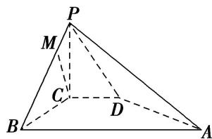

<!-- question-source:start -->
5. 如图所示，在四棱锥 $P - ABCD$ 中， $PC \perp$ 平面 $ABCD$ ， $PC = 2$ ，在四边形 $ABCD$ 中， $\angle B = \angle C = 90^\circ$ ， $AB = 4$ ， $CD = 1$ ，点 $M$ 在 $PB$ 上， $PB = 4PM$ ， $PB$ 与平面 $ABCD$ 成 $30^\circ$ 角，求证：

(1)CM//平面 PAD;

(2)平面 $PAB \perp$ 平面 $PAD$ .

<!-- question-source:end -->

![[高中/总复习/专题/立体几何/专题09 利用空间向量证明平行与垂直问题-立体几何（理科）/专题09_利用空间向量证明平行与垂直问题/对点训练/answers/Q00043613A1.md]]
