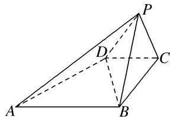

<!-- question-source:start -->
6. 如图所示，已知四棱锥 P-ABCD 的底面是直角梯形， $\angle ABC = \angle BCD = 90^{\circ}$ ，AB = BC = PB = PC = 2CD，

平面 $PBC \perp$ 底面ABCD．用向量方法证明：

(1) $PA \perp BD;$

(2)平面 PAD⊥平面 PAB.

<!-- question-source:end -->

![[高中/总复习/专题/立体几何/专题09 利用空间向量证明平行与垂直问题-立体几何（理科）/专题09_利用空间向量证明平行与垂直问题/对点训练/answers/Q00043614A1.md]]
