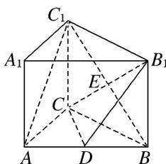
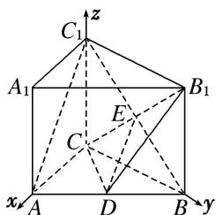

> [!faq]- 《专题09 利用空间向量证明平行与垂直问题-立体几何（理科）》例题解析
>
> > [!success]- **【答案】** 详见解析
>
> > [!note]- **【分析】**
> > 本题未单列分析。
>
> > [!note]- **【解析】**
> > (1)证明 $AC \perp BC_{1}$ ;
> > (2)证明 $AC_{1} \parallel$ 平面 $CDB_{1}$ .
> > 
> > 1. 解析 因为直三棱柱 $ABC-A_{1}B_{1}C_{1}$ 的底面边长分别为 AC=3, BC=4, AB=5,
> > 所以 $\triangle ABC$ 为直角三角形， $AC\perp BC$ 。所以AC，BC， $C_{1}C$ 两两垂直。
> > 如图，以 C 为坐标原点，直线 CA，CB， $CC_{1}$ 分别为 x 轴，y 轴，z 轴建立空间直角坐标系，
> > 则 $C(0, 0, 0)$ ， $A(3, 0, 0)$ ， $B(0, 4, 0)$ ， $C_{1}(0, 0, 4)$ ， $A_{1}(3, 0, 4)$ ， $B_{1}(0, 4, 4)$ ， $D\left(\frac{3}{2}, 2, 0\right)$ .
> > 
> > (1)因为 $\overrightarrow{AC} = (-3,0,0)$ , $\overrightarrow{BC_1} = (0, -4, 4)$ , 所以 $\overrightarrow{AC} \cdot \overrightarrow{BC_1} = 0$ , 所以 $AC \perp BC_1$ .
> > (2)设 $CB_{1}$ 与 $C_1B$ 的交点为 $E$ ，连接 $DE$ ，则 $E(0, 2, 2)$ ， $\overrightarrow{DE} = \left(-\frac{3}{2}, 0, 2\right)$ ， $\overrightarrow{AC_1} = (-3, 0, 4)$ ，所以 $\overrightarrow{DE} = \frac{1}{2}\overrightarrow{AC_1}$ ， $DE // AC_1$ 。因为 $DE \subset$ 平面 $CDB_{1}$ ， $AC_1 \notin$ 平面 $CDB_{1}$ ，所以 $AC_1 //$ 平面 $CDB_{1}$ 。
