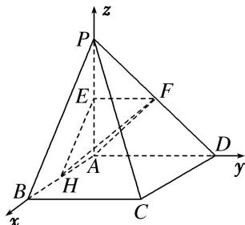

> [!faq]- 《专题09 利用空间向量证明平行与垂直问题-立体几何（理科）》例题解析
>
> > [!success]- **【答案】** D
>
> > [!note]- **【解析】**
> > 解析 建立如图所示的空间直角坐标系 $A - xyz$ . $\therefore A(0, 0, 0)$ , $B(2, 0, 0)$ , $C(2, 2, 0)$ , $D(0, 2, 0)$ , $P(0, 0, 2)$ , $E(0, 0, 1)$ , $F(0, 1, 1)$ , $H(1, 0, 0)$ .
> >
> > 
> >
> > (1)∵E，H分别是线段AP，AB的中点，∴PB//EH.
> >
> > ∵PB∉平面 EFH，且 $EH \subset$ 平面 EFH，∴PB∥平面 EFH.
> >
> > $$
> > (2) \overrightarrow {P D} = (0, 2, - 2), \overrightarrow {A H} = (1, 0, 0), \overrightarrow {A F} = (0, 1, 1),
> > $$
> >
> > $$
> > \therefore \overrightarrow {P D} \cdot \overrightarrow {A F} = 0 \times 0 + 2 \times 1 + (- 2) \times 1 = 0, \quad \overrightarrow {P D} \cdot \overrightarrow {A H} = 0 \times 1 + 2 \times 0 + (- 2) \times 0 = 0.
> > $$
> >
> > $\therefore PD \perp AF, PD \perp AH.$ 又 $\because AF \cap AH = A, \therefore PD \perp$ 平面 AHF.
