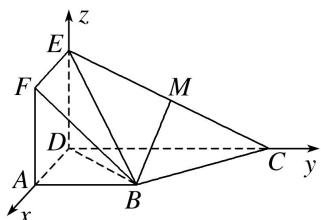

> [!faq]- 《专题09 利用空间向量证明平行与垂直问题-立体几何（理科）》例题解析
>
> > [!success]- **【答案】** 详见解析
>
> > [!note]- **【分析】**
> > 本题未单列分析。
>
> > [!note]- **【解析】**
> > (1)求证： $BM \parallel$ 平面 ADEF;
> > (2)求证： $BC \perp$ 平面 BDE.
> > 
> > 3. 解析 $\because$ 平面 $ADEF \perp$ 平面 $ABCD$ , 平面 $ADEF \cap$ 平面 $ABCD = AD$ , $AD \perp ED$ , $ED \subset$ 平面 $ADEF$ , $\therefore ED \perp$ 平面 $ABCD$ .
> > 
> > 以 D 为原点, $\overrightarrow{DA}, \overrightarrow{DC}, \overrightarrow{DE}$ 分别为 x 轴、y 轴、z 轴的正方向建立如图所示的空间直角坐标系. 则 $D(0, 0, 0)$ , $A(2, 0, 0)$ , $B(2, 2, 0)$ , $C(0, 4, 0)$ , $E(0, 0, 2)$ , $F(2, 0, 2)$ .
> > (1)∵M为EC的中点，∴ $M(0,2,1)$ ，则 $\overrightarrow{BM}=(-2,0,1)$ ， $\overrightarrow{AD}=(-2,0,0)$ ， $\overrightarrow{AF}=(0,0,2)$
> > $\therefore \overrightarrow{BM} = \overrightarrow{AD} + \frac{1}{2}\overrightarrow{AF}$ ，故 $\overrightarrow{BM}, \overrightarrow{AD}, \overrightarrow{AF}$ 共面．又 $BM \not\subset$ 平面 $ADEF$ ， $\therefore BM \parallel$ 平面 $ADEF$ ．
> > (2) $\overrightarrow{BC}=(-2,2,0),\quad\overrightarrow{DB}=(2,2,0),\quad\overrightarrow{DE}=(0,0,2),$
> > $\because \overrightarrow{BC} \cdot \overrightarrow{DB} = -4 + 4 = 0, \therefore BC \perp DB.$ 又 $\overrightarrow{BC} \cdot \overrightarrow{DE} = 0, \therefore BC \perp DE.$
> > 又 $DE \cap DB = D$ ，DE， $DB \subset$ 平面 BDE，∴ BC ⊥ 平面 BDE.
