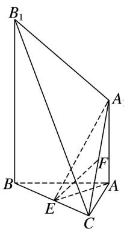
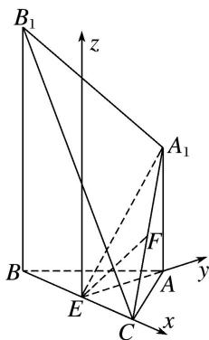

> [!faq]- 《专题09 利用空间向量证明平行与垂直问题-立体几何（理科）》例题解析
>
> > [!success]- **【答案】** 详见解析
>
> > [!note]- **【分析】**
> > 本题未单列分析。
>
> > [!note]- **【解析】**
> > (1)求证： $EF \parallel$ 平面 $A_{1}B_{1}BA$ ;
> > (2)求证：平面 $AEA_{1} \perp$ 平面 $BCB_{1}$ .
> > 
> > 7. 解析 因为 $AB = AC$ ， $E$ 为 $BC$ 的中点，所以 $AE \perp BC$ 。因为 $AA_{1} \perp$ 平面 $ABC$ ， $AA_{1} // BB_{1}$ ，所以以过 $E$ 作平行于 $BB_{1}$ 的垂线为 $z$ 轴， $EC$ ， $EA$ 所在直线分别为 $x$ 轴， $y$ 轴，建立如图所示的空间直角坐标系。
> > 
> > 因为 AB=3, $BE=\sqrt{5}$ ，所以 AE=2，所以 $E(0,0,0)$ ， $C(\sqrt{5},0,0)$ ， $A(0,2,0)$ ， $B(-\sqrt{5},0,0)$ ， $B_{1}(-\sqrt{5},0,2\sqrt{7})$ 。 $A_{1}(0,2,\sqrt{7})$ ，则 $F\left(\frac{\sqrt{5}}{2},1,\frac{\sqrt{7}}{2}\right)$ 。
> > (1) $\overrightarrow{EF}=\left(\frac{\sqrt{5}}{2},\quad1,\quad\frac{\sqrt{7}}{2}\right),\quad\overrightarrow{AB}=(-\sqrt{5},\quad-2,\quad0),\quad\overrightarrow{AA_{1}}=(0,\quad0,\quad\sqrt{7}).$
> > 设平面 $AA_{1}B_{1}B$ 的一个法向量为 $\boldsymbol{n}=(x,y,z)$ ，则 $\left\{\begin{aligned}\boldsymbol{n}\cdot\overrightarrow{AB}&=0,\\ \boldsymbol{n}\cdot\overrightarrow{AA_{1}}&=0,\end{aligned}\right.$ 所以 $\left\{\begin{aligned}-\sqrt{5}x-2y&=0,\\ \sqrt{7}z&=0,\end{aligned}\right.$
> > 取 $\left\{\begin{aligned}x&=-2,\\ y&=\sqrt{5},\\ z&=0,\end{aligned}\right.$ 所以 $n=(-2,\sqrt{5},0)$ .
> > 因为 $\vec{EF} \cdot n = \frac{\sqrt{5}}{2} \times (-2) + 1 \times \sqrt{5} + \frac{\sqrt{7}}{2} \times 0 = 0$ ，所以 $\vec{EF} \perp n$ .
> > $$
> > E F \not \subset
> > $$
> > $$
> > A _ {1} B _ {1} B A
> > $$
> > $$
> > A _ {1} B _ {1} B A
> > $$
> > (2)因为 $EC \perp$ 平面 $AEA_{1}$ ，所以 $\vec{EC} = (\sqrt{5}, 0, 0)$ 为平面 $AEA_{1}$ 的一个法向量。又 $EA \perp$ 平面 $BCB_{1}$ ，所以 $\vec{EA} = (0, 2, 0)$ 为平面 $BCB_{1}$ 的一个法向量。因为 $\vec{EC} \cdot \vec{EA} = 0$ ，所以 $\vec{EC} \perp \vec{EA}$ ，故平面 $AEA_{1} \perp$ 平面 $BCB_{1}$ 。
