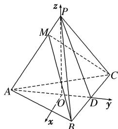

> [!faq]- 《专题09 利用空间向量证明平行与垂直问题-立体几何（理科）》例题解析
>
> > [!success]- **【答案】** 详见解析
>
> > [!note]- **【解析】**
> > 解析 如图所示，以 O 为坐标原点，以射线 OP 为 z 轴的正半轴建立空间直角坐标系 O-xyz．则 $O(0, 0, 0)$ ， $A(0, -3, 0)$ ， $B(4, 2, 0)$ ， $C(-4, 2, 0)$ ， $P(0, 0, 4)$ .
> >
> > 
> >
> > (1) $\because \overrightarrow{AP} = (0, 3, 4), \overrightarrow{BC} = (-8, 0, 0), \therefore \overrightarrow{AP} \cdot \overrightarrow{BC} = (0, 3, 4) \cdot (-8, 0, 0) = 0,$
> >
> > 所以 $\overrightarrow{AP}\perp\overrightarrow{BC}$ ，即 $AP\perp BC$ .
> >
> > (2)由
> > (1)知 $|AP|=5$ ，又 $|AM|=3$ ，且点M在线段AP上， $\therefore\overrightarrow{AM}=\frac{3}{5}\overrightarrow{AP}=\left(0,\frac{9}{5},\frac{12}{5}\right)$ .
> >
> > $$
> > \overrightarrow {A C} = (- 4, 5, 0), \overrightarrow {B A} = (- 4, - 5, 0), \therefore \overrightarrow {B M} = \overrightarrow {B A} + \overrightarrow {A M} = \left[ - 4, - \frac {1 6}{5}, \frac {1 2}{5} \right],
> > $$
> >
> > 则 $\overrightarrow{AP}\cdot\overrightarrow{BM}=(0,3,4)\cdot\left(-4,-\frac{16}{5},\frac{12}{5}\right)=0,\therefore\overrightarrow{AP}\perp\overrightarrow{BM}$ ，即 $AP\perp BM$ ，
> >
> > 又根据
> > (1)的结论知 $AP \perp BC$ ， $BM \cap BC = B$ ，∴ $AP \perp$ 平面 BMC，于是 $AM \perp$ 平面 BMC，又 $AM \subset$ 平面 AMC，故平面 $AMC \perp$ 平面 BCM.
