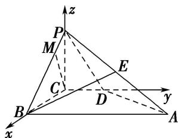

> [!faq]- 《专题09 利用空间向量证明平行与垂直问题-立体几何（理科）》例题解析
>
> > [!success]- **【答案】** B
>
> > [!note]- **【解析】**
> > 解析
> > (1)由题意知，CB, CD, CP 两两垂直，以 C 为坐标原点，CB 所在直线为 x 轴，CD 所在直线为 y 轴，CP 所在直线为 z 轴建立如图所示的空间直角坐标系 C-xyz.
> >
> > ∵ PC⊥平面 ABCD, ∴∠PBC 为 PB 与平面 ABCD 所成的角, ∴∠PBC=30°.
> >
> > ∵ PC=2, ∴ BC=2√3, PB=4,
> >
> > ∴ D(0, 1, 0), B(2√3, 0, 0), A(2√3, 4, 0), P(0, 0, 2), M{√3/2, 0, 3/2},
> >
> > ∴ $\overrightarrow{DP}=(0,-1,2)$ , $\overrightarrow{DA}=(2\sqrt{3},3,0)$ , $\overrightarrow{CM}=\left(\frac{\sqrt{3}}{2},0,\frac{3}{2}\right)$ .
> >
> > 设 n=(x, y, z) 为平面 PAD 的一个法向量，由 $\left\{\begin{aligned}\overrightarrow{DP}\cdot n &= 0, \\ \overrightarrow{DA}\cdot n &= 0,\end{aligned}\right.$ 即 $\left\{\begin{aligned}-y+2z &= 0, \\ 2\sqrt{3}x + 3y &= 0,\end{aligned}\right.$ 令 y=2，得 $n=(-\sqrt{3},2,1)$ .
> >
> > ∵ $n\cdot\overrightarrow{CM}=-\sqrt{3}\times\frac{\sqrt{3}}{2}+2\times0+1\times\frac{3}{2}=0$ , ∴ $n\perp\overrightarrow{CM}$ . 又 CM∉平面 PAD, ∴ CM// 平面 PAD.
> >
> > 
> >
> > (2)法一：由
> > (1)知 $\overrightarrow{BA}=(0,4,0)$ ， $\overrightarrow{PB}=(2\sqrt{3},0,-2)$ ,
> >
> > 设平面 PAB 的一个法向量为 $\boldsymbol{m}=(x_{0},y_{0},z_{0})$ ，由 $\left\{\begin{aligned}\overrightarrow{BA}\cdot\boldsymbol{m}&=0,\\ \overrightarrow{PB}\cdot\boldsymbol{m}&=0,\end{aligned}\right.$ 即 $\left\{\begin{aligned}4y_{0}&=0,\\ 2\sqrt{3}x_{0}-2z_{0}&=0,\end{aligned}\right.$
> >
> > 令 $x_{0}=1$ ，得 $m=(1,0,\sqrt{3})$ 。又∵平面 PAD 的一个法向量 $n=(-\sqrt{3},2,1)$ ，
> >
> > ∴ $m \cdot n = 1 \times (-\sqrt{3}) + 0 \times 2 + \sqrt{3} \times 1 = 0$ ，∴ 平面 $PAB \perp$ 平面 PAD.
> >
> > 法二：取 $AP$ 的中点 $E$ ，连接 $BE$ ，则 $E(\sqrt{3},2,1)$ ， $\overrightarrow{BE} = (-\sqrt{3},2,1)$
> >
> > $\because PB=AB,\therefore BE\perp PA.$ 又 $\because\overrightarrow{BE}\cdot\overrightarrow{DA}=(-\sqrt{3},2,1)\cdot(2\sqrt{3},3,0)=0,$
> >
> > $\therefore\overrightarrow{BE}\perp\overrightarrow{DA}.\quad\therefore BE\perp DA.$ 又 $PA\cap DA=A,\quad\therefore BE\perp$ 平面 PAD.
> >
> > 又∵BE⊂平面PAB，∴平面PAB⊥平面PAD.
