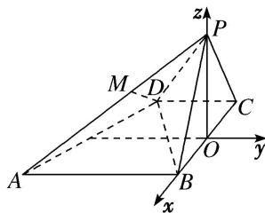

> [!faq]- 《专题09 利用空间向量证明平行与垂直问题-立体几何（理科）》例题解析
>
> > [!success]- **【答案】** A
>
> > [!note]- **【解析】**
> > 解析
> > (1)取 BC 的中点 O，连接 PO，∵△PBC 为等边三角形，∴PO⊥BC.
> >
> > ∵平面 $PBC \perp$ 底面 ABCD，平面 $PBC \cap$ 底面 ABCD = BC，PO < 平面 PBC，∴ $PO \perp$ 底面 ABCD.
> > 以 BC 的中点 O 为坐标原点，以 BC 所在直线为 x 轴，过点 O 与 AB 平行的直线为 y 轴，OP 所在直线为 z 轴，建立空间直角坐标系，如图所示．不妨设 CD=1，则 $AB=BC=2,\quad PO=\sqrt{3}$ ，
> >
> > 
> >
> > $\therefore A(1, -2, 0), B(1, 0, 0), D(-1, -1, 0), P(0, 0, \sqrt{3}),$
> >
> > $$
> > \therefore \overrightarrow {B D} = (- 2, - 1, 0), \overrightarrow {P A} = (1, - 2, - \sqrt {3}).
> > $$
> >
> > $$
> > \because \overrightarrow {B D} \cdot \overrightarrow {P A} = (- 2) \times 1 + (- 1) \times (- 2) + 0 \times (- \sqrt {3}) = 0, \therefore \overrightarrow {P A} \perp \overrightarrow {B D}, \therefore P A \perp B D.
> > $$
> >
> > (2)取 $PA$ 的中点 $M$ ，连接 $DM$ ，则 $M\left(\frac{1}{2}, - 1,\frac{\sqrt{3}}{2}\right)$ $\because \overrightarrow{DM} = \left(\frac{3}{2},0,\frac{\sqrt{3}}{2}\right),\overrightarrow{PB} = (1,0, - \sqrt{3}),$
> >
> > $\therefore \overrightarrow{DM} \cdot \overrightarrow{PB} = \frac{3}{2} \times 1 + 0 \times 0 + \frac{\sqrt{3}}{2} \times (-\sqrt{3}) = 0, \therefore \overrightarrow{DM} \perp \overrightarrow{PB}$ , 即 $DM \perp PB$ .
> >
> > $\because \overrightarrow{DM} \cdot \overrightarrow{PA} = \frac{3}{2} \times 1 + 0 \times (-2) + \frac{\sqrt{3}}{2} \times (-\sqrt{3}) = 0, \therefore \overrightarrow{DM} \perp \overrightarrow{PA}$ , 即 $DM \perp PA$ .
> >
> > 又∵ $PA\cap PB=P$ ，PA⊂平面PAB，PB⊂平面PAB，∴DM⊥平面PAB.
> >
> > ∵DM⊂平面 PAD，∴平面 PAD⊥平面 PAB.
