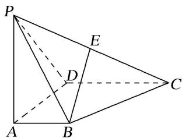
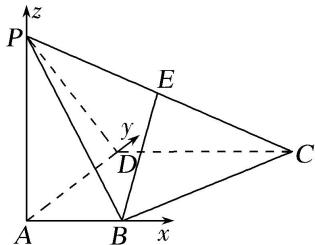

> [!faq]- 《专题09 利用空间向量证明平行与垂直问题-立体几何（理科）》例题解析
>
> > [!success]- **【答案】** 详见解析
>
> > [!note]- **【分析】**
> > 本题未单列分析。
>
> > [!note]- **【解析】**
> > (1) $BE \perp DC;$
> >
> > (2)BE//平面 PAD;
> >
> > (3)平面 $PCD \perp$ 平面 $PAD$ .
> >
> > 
> >
> > 8. 解析 依题意，以点 A 为原点建立空间直角坐标系(如图)，可得 $B(1, 0, 0)$ ， $C(2, 2, 0)$ ， $D(0, 2, 0)$ ， $P(0, 0, 2)$ 。由 E 为棱 PC 的中点，得 $E(1, 1, 1)$ 。
> >
> > 
> >
> > (1)向量 $\overrightarrow{BE}=(0,1,1)$ ， $\overrightarrow{DC}=(2,0,0)$ ，故 $\overrightarrow{BE}\cdot\overrightarrow{DC}=0$ ．所以 $BE\perp DC$
> >
> > (2)因为 $AB \perp AD$ ，又 $PA \perp$ 平面 ABCD， $AB \subset$ 平面 ABCD，
> >
> > 所以 $AB \perp PA$ ， $PA \cap AD = A$ ，PA，AD⊂平面 PAD，所以 $AB \perp$ 平面 PAD，
> >
> > 所以向量 $\overrightarrow{AB}=(1,0,0)$ 为平面PAD的一个法向量，
> >
> > 而 $\overrightarrow{BE}\cdot\overrightarrow{AB}=(0,1,1)\cdot(1,0,0)=0$ ，所以 $BE\perp AB$ ，
> >
> > 又 $BE \notin$ 平面 PAD，所以 $BE \parallel$ 平面 PAD.
> >
> > (3)由
> > (2)知平面 PAD 的法向量 $\overrightarrow{AB}=(1,0,0)$ ，向量 $\overrightarrow{PD}=(0,2,-2)$ ， $\overrightarrow{DC}=(2,0,0)$ ,
> >
> > 设平面 PCD 的法向量为 $\boldsymbol{n}=(x,y,z)$ ，则 $\left\{\begin{aligned}\boldsymbol{n}\cdot\overrightarrow{PD}&=0,\\ \boldsymbol{n}\cdot\overrightarrow{DC}&=0,\end{aligned}\right.$ 即 $\left\{\begin{aligned}2y-2z&=0,\\ 2x&=0,\end{aligned}\right.$ 不妨令 y=1，
> >
> > 可得 $n=(0,1,1)$ 为平面 PCD 的一个法向量.
> >
> > 且 $\boldsymbol{n}\cdot\overrightarrow{AB}=(0,1,1)\cdot(1,0,0)=0$ ，所以 $n\perp\overrightarrow{AB}$ .
> >
> > 所以平面 PAD⊥平面 PCD.
