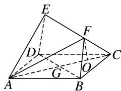
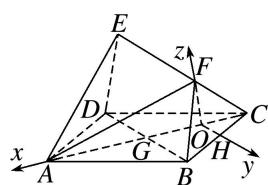

> [!faq]- 《专题09 利用空间向量证明平行与垂直问题-立体几何（理科）》例题解析
>
> > [!success]- **【答案】** 详见解析
>
> > [!note]- **【分析】**
> > 本题未单列分析。
>
> > [!note]- **【解析】**
> > (1)求证： $AE \parallel$ 平面 BCF;
> > (2)求证： $CF \perp$ 平面 AEF.
> > 
> > 解析 如图，
> > 
> > 取 BC 的中点 H，连接 OH，则 $OH \parallel BD$ ，又四边形 ABCD 为正方形，∴ $AC \perp BD$ ，∴ $OH \perp AC$ ，故以 O 为原点，建立如图所示的直角坐标系，
> > 则 $A(3, 0, 0)$ ， $C(-1, 0, 0)$ ， $D(1, -2, 0)$ ， $F(0, 0, \sqrt{3})$ ， $B(1, 2, 0)$ . $\overrightarrow{BC}=(-2,-2,0)$ , $\overrightarrow{CF}=(1,0,\sqrt{3})$ , $\overrightarrow{BF}=(-1,-2,\sqrt{3})$ .
> > (1)设平面 $BCF$ 的一个法向量为 $\pmb {n} = (x,y,z)$ .则 $\left\{ \begin{array}{l}\pmb {n}\cdot \overrightarrow{BC} = 0,\\ \pmb {n}\cdot \overrightarrow{CF} = 0, \end{array} \right.$ 即 $\left\{ \begin{array}{l} - 2x - 2y = 0,\\ x + \sqrt{3} z = 0, \end{array} \right.$
> > 取 z=1，得 $n=(-\sqrt{3},\sqrt{3},1)$ 。又四边形 BDEF 为平行四边形，∴ $\overrightarrow{DE}=\overrightarrow{BF}=(-1,-2,\sqrt{3})$ ，
> > ∴ $\overrightarrow{AE} = \overrightarrow{AD} + \overrightarrow{DE} = \overrightarrow{BC} + \overrightarrow{BF} = (-2, -2, 0) + (-1, -2, \sqrt{3}) = (-3, -4, \sqrt{3})$ ,
> > $\therefore \overrightarrow{AE} \cdot n = 3\sqrt{3} - 4\sqrt{3} + \sqrt{3} = 0, \therefore \overrightarrow{AE} \perp n,$ 又 $AE \not\subset$ 平面 $BCF, \therefore AE \parallel$ 平面 $BCF.$
> > (2) $\overrightarrow{AF}=(-3,\ 0,\ \sqrt{3}),\ \therefore\overrightarrow{CF}\cdot\overrightarrow{AF}=-3+3=0,\ \overrightarrow{CF}\cdot\overrightarrow{AE}=-3+3=0,\ \therefore\overrightarrow{CF}\perp\overrightarrow{AF},\ \overrightarrow{CF}\perp\overrightarrow{AE},$
> > 即 $CF \perp AF$ ， $CF \perp AE$ ，又 $AE \cap AF = A$ ，AE， $AF \subset$ 平面 AEF，∴ $CF \perp$ 平面 AEF.
