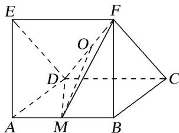
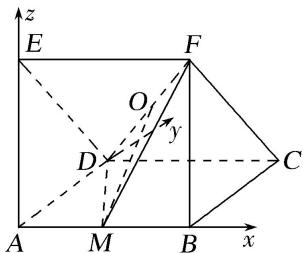

> [!faq]- 《专题09 利用空间向量证明平行与垂直问题-立体几何（理科）》例题解析
>
> > [!success]- **【答案】** 详见解析
>
> > [!note]- **【分析】**
> > 本题未单列分析。
>
> > [!note]- **【解析】**
> > (1)OM// 平面 BCF;
> > (2)平面 $MDF \perp$ 平面 $EFCD$ .
> > 
> > 解析 (1)由题意, 得 $AB$ , $AD$ , $AE$ 两两垂直, 以点 $A$ 为原点建立如图所示的空间直角坐标系 $A-xyz$ .
> > 
> > 设正方形边长为 1，则 $A(0, 0, 0)$ ， $B(1, 0, 0)$ ， $C(1, 1, 0)$ ， $D(0, 1, 0)$ ， $F(1, 0, 1)$ ， $M\left(\frac{1}{2}, 0, 0\right)$ ， $O\left(\frac{1}{2}, \frac{1}{2}, \frac{1}{2}\right)$ . $\overrightarrow{OM} = \left(0, -\frac{1}{2}, -\frac{1}{2}\right)$ ， $\overrightarrow{BA} = (-1, 0, 0)$ ， $\therefore \overrightarrow{OM} \cdot \overrightarrow{BA} = 0$ ， $\therefore \overrightarrow{OM} \perp \overrightarrow{BA}$ .
> > ∵棱柱 ADE-BCF 是直三棱柱，∴AB⊥平面 BCF，∴ $\overrightarrow{BA}$ 是平面 BCF 的一个法向量，
> > 且 $OM \notin$ 平面 $BCF$ , $\therefore OM \parallel$ 平面 $BCF$ .
> > (2)在第(1)问的空间直角坐标系中，设平面 $MDF$ 与平面 $EFCD$ 的法向量分别为 $\pmb{n}_1 = (x_1, y_1, z_1)$ ， $\pmb{n}_2 = (x_2, y_2, z_2)$ . $\because \overrightarrow{DF} = (1, -1, 1)$ ， $\overrightarrow{DM} = \left[\frac{1}{2}, -1, 0\right]$ ， $\overrightarrow{DC} = (1, 0, 0)$ ， $\overrightarrow{CF} = (0, -1, 1)$ ，
> > 由 $\left\{\begin{aligned}\boldsymbol{n}_{1}\cdot\overrightarrow{DF}&=0,\\ \boldsymbol{n}_{1}\cdot\overrightarrow{DM}&=0,\end{aligned}\right.$ 得 $\left\{\begin{aligned}x_{1}-y_{1}+z_{1}&=0,\\ \frac{1}{2}x_{1}-y_{1}&=0,\end{aligned}\right.$ 令 $x_{1}=1$ ，则 $\boldsymbol{n}_{1}=\left(\begin{aligned}1,&\frac{1}{2},&-\frac{1}{2}\end{aligned}\right)$ . 同理可得 $\boldsymbol{n}_{2}=(0,1,1)$ .
> > $\because n_{1}\cdot n_{2}=0,\quad\therefore$ 平面 MDF⊥平面 EFCD.
