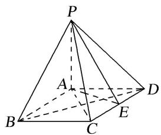

<!-- question-source:start -->
[例 2] (2019·北京)如图，在四棱锥 P-ABCD 中，PA⊥平面 ABCD，底面 ABCD 为菱形，E 为 CD 的中点.

(1)求证： $BD \perp$ 平面 PAC;

(2)若 $\angle ABC=60^{\circ}$ ，求证：平面 $PAB\perp$ 平面 $PAE$ ;

(3)棱 $PB$ 上是否存在点 $F$ , 使得 $CF \parallel$ 平面 $PAE$ ? 说明理由.

<!-- question-source:end -->

![[高中/总复习/专题/立体几何/专题09 立体几何中的探索性问题-立体几何（文科）/考点01_探究平行问题/例题/answers/Q00043617A1.md]]
