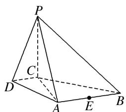

<!-- question-source:start -->
[例 3] (2016·北京)如图，在四棱锥 P-ABCD 中，PC⊥平面 ABCD， $AB \parallel DC$ ， $DC \perp AC$ .

(1)求证： $DC \perp$ 平面PAC.

(2)求证：平面 $PAB \perp$ 平面 $PAC$ .

(3)设点 E 为 AB 的中点，在棱 PB 上是否存在点 F，使得 PA // 平面 CEF？说明理由.

<!-- question-source:end -->

![[高中/总复习/专题/立体几何/专题09 立体几何中的探索性问题-立体几何（文科）/考点01_探究平行问题/例题/answers/Q00043618A1.md]]
