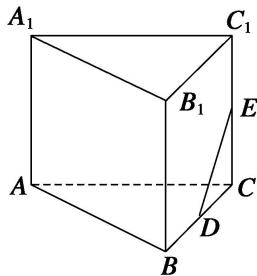

<!-- question-source:start -->
[例 4] (2014·四川)在如图所示的多面体中，四边形 $ABB_{1}A_{1}$ 和 $ACC_{1}A_{1}$ 都为矩形.

(1)若 $AC \perp BC$ ，证明：直线 $BC \perp$ 平面 $ACC_{1}A_{1}$ ;

(2)设 $D$ ， $E$ 分别是线段 $BC$ ， $CC_{1}$ 的中点，在线段 $AB$ 上是否存在一点 $M$ ，使直线 $DE / /$ 平面 $A_{1}MC?$ 请证明你的结论.

<!-- question-source:end -->

![[高中/总复习/专题/立体几何/专题09 立体几何中的探索性问题-立体几何（文科）/考点01_探究平行问题/例题/answers/Q00043619A1.md]]
