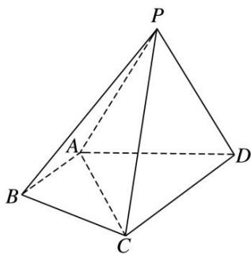
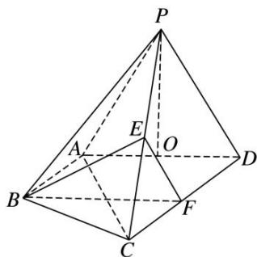

<!-- question-source:start -->
[例 5]如图，在四棱锥 P—ABCD 中， $\triangle PAD$ 为正三角形，平面 $PAD \perp$ 平面 ABCD， $AB \parallel CD$ ， $AB \perp AD$ ， $CD = 2AB = 2AD = 4$ .

(1)求证：平面 $PCD \perp$ 平面 $PAD$ ;

(2)求三棱锥 P—ABC 的体积;

(3)在棱 $PC$ 上是否存在点 $E$ ，使得 $BE \parallel$ 平面 $PAD$ ？若存在，请确定点 $E$ 的位置并证明；若不存在，请说明理由.

(1)因为 $AB \parallel CD$ ， $AB \perp AD$ ，所以 $CD \perp AD$ .

因为平面 $PAD \perp$ 平面 ABCD，平面 $PAD \cap$ 平面 ABCD = AD，所以 $CD \perp$ 平面 PAD.

因为 $CD \subset$ 平面 PCD，所以平面 $PCD \perp$ 平面 PAD.

(2)取 AD 的中点 O，连接 PO．因为 $\triangle PAD$ 为正三角形，所以 $PO \perp AD$ .

因为平面 $PAD \perp$ 平面 ABCD，平面 $PAD \cap$ 平面 ABCD = AD， $PO \subset$ 平面 PAD，

所以 $PO \perp$ 平面 ABCD，所以 PO 为三棱锥 P—ABC 的高.

因为 $\triangle PAD$ 为正三角形，CD=2AB=2AD=4，所以 $PO=\sqrt{3}$ .

所以 $V_{三棱锥 P-ABC}=\frac{1}{3}S_{\triangle ABC}\cdot PO=\frac{1}{3}\times\frac{1}{2}\times2\times2\times\sqrt{3}=\frac{2\sqrt{3}}{3}.$

(3)在棱 PC 上存在点 E，当 E 为 PC 的中点时，BE // 平面 PAD.

分别取 CP, CD 的中点 E, F, 连接 BE, BF, EF, 所以 $EF \parallel PD$ . 因为 $AB \parallel CD$ , CD = 2AB,

所以 $AB \parallel FD$ ，AB = FD，所以四边形 ABFD 为平行四边形，所以 $BF \parallel AD$ 。

因为 $BF \cap EF = F, AD \cap PD = D$ ，所以平面 BEF // 平面 PAD。因为 $BE \subset$ 平面 BEF，所以 BE // 平面 PAD。
<!-- question-source:end -->

![[高中/总复习/专题/立体几何/专题09 立体几何中的探索性问题-立体几何（文科）/考点01_探究平行问题/例题/answers/Q00043620A1.md]]
