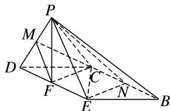

<!-- question-source:start -->
[例6]如图1，已知菱形AECD的对角线 $AC$ ，DE交于点 $F$ ，点 $E$ 为 $AB$ 中点．将 $\triangle ADE$ 沿线段 $DE$ 折起到 $\triangle PDE$ 的位置，如图2所示.

(1)求证： $DE \perp$ 平面 PCF;

(2)求证：平面 $PBC \perp$ 平面 PCF;

(3)在线段 $PD$ ， $BC$ 上是否分别存在点 $M$ ， $N$ ，使得平面 $CFM \parallel$ 平面 $PEN$ ？若存在，请指出点 $M$ ， $N$ 的位置，并证明；若不存在，请说明理由。

  
图1

  
图2

(1)折叠前，因为四边形 AECD 为菱形，所以 $AC \perp DE$ ，所以折叠后， $DE \perp PF$ ， $DE \perp CF$ ，又 $PF \cap CF = F$ ，PF， $CF \subset$ 平面 PCF，所以 $DE \perp$ 平面 PCF.

(2)因为四边形 AECD 为菱形，所以 DC // AE，DC = AE.

又点 $E$ 为 $AB$ 的中点，所以 $DC \parallel EB$ ， $DC = EB$ ，所以四边形 $DEBC$ 为平行四边形，所以 $CB \parallel DE$ 。又由
(1)得， $DE \perp$ 平面 $PCF$ ，所以 $CB \perp$ 平面 $PCF$ 。因为 $CB \subset$ 平面 $PBC$ ，所以平面 $PBC \perp$ 平面 $PCF$ 。

(3)存在满足条件的点 $M, N$ ，且 $M, N$ 分别是 $PD$ 和 $BC$ 的中点。

如图，分别取 PD 和 BC 的中点 M, N. 连接 EN, PN, MF, CM.

因为四边形 DEBC 为平行四边形，所以 $EF \parallel CN$ ， $EF = \frac{1}{2} BC = CN$ ，

所以四边形 ENCF 为平行四边形，所以 FC // EN.

在 $\triangle PDE$ 中，M，F分别为PD，DE的中点，所以 $MF\parallel PE$ .

又 EN, PE⊂平面 PEN, PE∩EN=E, MF, CF⊂平面 CFM, MF∩CF=F,

所以平面 CFM// 平面 PEN.

## 【对点训练】
<!-- question-source:end -->

![[高中/总复习/专题/立体几何/专题09 立体几何中的探索性问题-立体几何（文科）/考点01_探究平行问题/例题/answers/Q00043621A1.md]]
