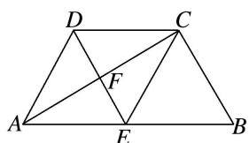
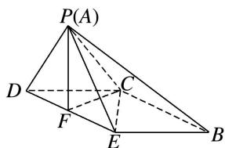

<!-- question-source:start -->
[例6]如图1，已知菱形AECD的对角线 $AC$ ，DE交于点 $F$ ，点 $E$ 为 $AB$ 中点．将 $\triangle ADE$ 沿线段 $DE$ 折起到 $\triangle PDE$ 的位置，如图2所示.

(1)求证： $DE \perp$ 平面 PCF;

(2)求证：平面 $PBC \perp$ 平面 PCF;

(3)在线段 $PD$ ， $BC$ 上是否分别存在点 $M$ ， $N$ ，使得平面 $CFM \parallel$ 平面 $PEN$ ？若存在，请指出点 $M$ ， $N$ 的位置，并证明；若不存在，请说明理由。

  
图1

  
图2
<!-- question-source:end -->

![[高中/总复习/专题/立体几何/专题09 立体几何中的探索性问题-立体几何（文科）/考点01_探究平行问题/例题/answers/Q00043621A1.md]]
