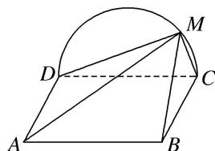
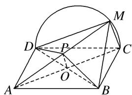

> [!faq]- 《专题09 立体几何中的探索性问题-立体几何（文科）》例题解析
>
> > [!success]- **【答案】** 详见解析
>
> > [!note]- **【分析】**
> > 本题未单列分析。
>
> > [!note]- **【解析】**
> > (1)证明：平面 $AMD \perp$ 平面 BMC.
> > (2)在线段 AM 上是否存在点 P，使得 MC // 平面 PBD？说明理由.
> > 
> > 解析 (1)由题设知，平面 $CMD \perp$ 平面 ABCD，交线为 CD.
> > 因为 $BC \perp CD$ ， $BC \subset$ 平面 ABCD，所以 $BC \perp$ 平面 CMD，所以 $BC \perp DM$ .
> > 因为 M 为 $\widehat{CD}$ 上异于 C, D 的点，且 DC 为直径，所以 $DM \perp CM$ .
> > 又 $BC \cap CM = C$ ，所以 $DM \perp$ 平面 $BMC$ 。因为 $DM \subset$ 平面 $AMD$ ，所以平面 $AMD \perp$ 平面 $BMC$ 。
> > (2)当 $P$ 为 $AM$ 的中点时, $MC \parallel$ 平面 $PBD$ . 证明如下:
> > 
> > 连接 AC 交 BD 于 O. 因为四边形 ABCD 为矩形，所以 O 为 AC 的中点.
> > 连接 OP，因为 P 为 AM 的中点，所以 MC // OP.
> > 又 $MC \not\subset$ 平面 PBD， $OP \subset$ 平面 PBD，所以 $MC \parallel$ 平面 PBD.
