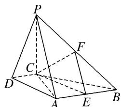

> [!faq]- 《专题09 立体几何中的探索性问题-立体几何（文科）》例题解析
>
> > [!success]- **【答案】** 详见解析
>
> > [!note]- **【分析】**
> > 本题未单列分析。
>
> > [!note]- **【解析】**
> > (1)求证： $DC \perp$ 平面PAC.
> > (2)求证：平面 $PAB \perp$ 平面 $PAC$ .
> > (3)设点 E 为 AB 的中点，在棱 PB 上是否存在点 F，使得 PA // 平面 CEF？说明理由.
> > 
> > 解析 (1)因为 $PC \perp$ 平面 ABCD，所以 $PC \perp DC$ .
> > 又因为 $DC \perp AC$ ，且 $PC \cap AC = C$ ，所以 $DC \perp$ 平面 PAC.
> > (2)因为 $AB \parallel DC$ ， $DC \perp AC$ ，所以 $AB \perp AC$ 。因为 $PC \perp$ 平面 ABCD，所以 $PC \perp AB$ 。
> > 又因为 $PC \cap AC = C$ ，所以 $AB \perp$ 平面 PAC。又 $AB \subset$ 平面 PAB，所以平面 $PAB \perp$ 平面 PAC。
> > 
> > (3)棱 $PB$ 上存在点 $F$ , 使得 $PA \parallel$ 平面 $CEF$ . 理由如下:
> > 取 $PB$ 的中点 $F$ , 连接 $EF$ , $CE$ , $CF$ . 因为 $E$ 为 $AB$ 的中点, 所以 $EF \parallel PA$ .
> > 又因为 $PA \not\subset$ 平面 CEF，且 $EF \subset$ 平面 CEF，所以 $PA \parallel$ 平面 CEF.
