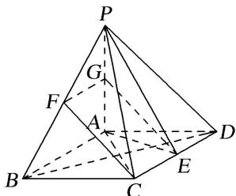

> [!faq]- 《专题09 立体几何中的探索性问题-立体几何（文科）》例题解析
>
> > [!success]- **【答案】** 详见解析
>
> > [!note]- **【分析】**
> > 本题未单列分析。
>
> > [!note]- **【解析】**
> > 解析
> > (1)因为 $PA \perp$ 平面 $ABCD$ , $BD \subset$ 平面 $ABCD$ , 所以 $PA \perp BD$ .
> >
> > 
> >
> > 因为底面 ABCD 为菱形，所以 $BD \perp AC$ 。又 $PA \cap AC = A$ ，所以 $BD \perp$ 平面 PAC。
> >
> > (2)因为 $PA \perp$ 平面 ABCD， $AE \subset$ 平面 ABCD，所以 $PA \perp AE$ .
> >
> > 因为底面 ABCD 为菱形， $\angle ABC=60^{\circ}$ ，且 E 为 CD 的中点，
> >
> > 所以 $AE \perp CD$ 。又因为 $AB \parallel CD$ ，所以 $AB \perp AE$ 。又 $AB \cap PA = A$ ，所以 $AE \perp$ 平面 PAB。
> >
> > 因为 $AE \subset$ 平面 PAE，所以平面 $PAB \perp$ 平面 PAE.
> >
> > (3)棱 $PB$ 上存在点 $F$ , 使得 $CF \parallel$ 平面 $PAE$ . 理由如下:
> >
> > 取 $PB$ 的中点 $F$ , $PA$ 的中点 $G$ , 连接 $CF$ , $FG$ , $EG$ , 则 $FG \parallel AB$ , 且 $FG = \frac{1}{2} AB$ .
> >
> > 因为底面 ABCD 为菱形，且 E 为 CD 的中点，所以 $CE \parallel AB$ ，且 $CE = \frac{1}{2} AB$ .
> >
> > 所以 $FG \parallel CE$ ，且 FG = CE。所以四边形 CEGF 为平行四边形。所以 $CF \parallel EG$ 。
> >
> > 因为 $CF \not\subset$ 平面 PAE， $EG \subset$ 平面 PAE，所以 $CF \parallel$ 平面 PAE.
