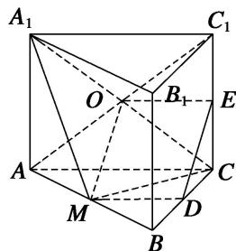

> [!faq]- 《专题09 立体几何中的探索性问题-立体几何（文科）》例题解析
>
> > [!success]- **【答案】** 详见解析
>
> > [!note]- **【解析】**
> > 解析
> > (1)因为四边形 $ABB_{1}A_{1}$ 和 $ACC_{1}A_{1}$ 都是矩形，所以 $AA_{1} \perp AB, AA_{1} \perp AC$ .
> >
> > 因为 AB, AC 为平面 ABC 内两条相交的直线，所以 $AA_{1} \perp$ 平面 ABC.
> >
> > 因为直线 $BC \subset$ 平面 ABC，所以 $AA_{1} \perp BC$ .
> >
> > 又由已知， $AC \perp BC$ ， $AA_{1}$ 和 AC 为平面 $ACC_{1}A_{1}$ 内两条相交的直线，所以 $BC \perp$ 平面 $ACC_{1}A_{1}$ .
> >
> > 
> >
> > (2)取线段 AB 的中点 M，连接 $A_{1}M$ ，MC， $A_{1}C$ ， $AC_{1}$ ，设点 O 为 $A_{1}C$ ， $AC_{1}$ 的交点.
> >
> > 由已知，点 O 为 $AC_{1}$ 的中点．连接 MD，OE，则 MD，OE 分别为 $\triangle ABC$ ， $\triangle ACC_{1}$ 的中位线，
> >
> > 所以 $MD \xlongequal{\parallel} \frac{1}{2} AC, OE \xlongequal{\parallel} \frac{1}{2} AC$ ，因此 MD 線 OE。连接 OM，从而四边形 MDEO 为平行四边形，则 DE // MO。
> >
> > 因为直线 $DE \not\subset$ 平面 $A_{1}MC$ ， $MO \subset$ 平面 $A_{1}MC$ ，所以直线 $DE \parallel$ 平面 $A_{1}MC$ .
> >
> > 即线段 AB 上存在一点 M(线段 AB 的中点)，使直线 DE // 平面 $A_{1}MC$ .
